# 如何构建一个简单的 Android App-compose 原生开发

# 1 什么是 Android App 和 Android 开发

在这篇教程中，我们将完整跑通一条闭环：**从脑海中的一个想法，到在安卓手机上可以成功安装并运行的真实 App。**

本次教程，你至少需要具备：

- 一台性能尚可的电脑（Windows 或 Mac 均可）
- 一台安卓手机（可选，如果没有，我们将使用模拟器）
- 已下载 Android Studio（用于构建）
- 已下载并注册 Trae（用于 AI 编程）

## 1.1 Android App 的定义

Android App 是运行在 Android 操作系统上的原生应用程序。与小程序不同，它不依赖微信等宿主，直接运行在系统层。它拥有独立的桌面图标，启动速度快，交互流畅，并且可以深度调用蓝牙、传感器、后台服务等系统底层功能。


## 1.2 Android App开发

Android 开发是指构建上述应用程序的全过程。在本教程的Vibe Coding 开发模式中，借助 **AI 辅助编程模式，** 它将开发者的角色从过去的“代码撰写者”转变为“产品架构师”：

1. **你（架构师/** **PM** **）** ：负责业务逻辑设计、Prompt（提示词）编写以及最终效果验收。
2. **Trae（AI 工程师）** ：负责执行指令，将自然语言转化为标准的 Kotlin 代码和 Jetpack Compose 布局，并处理语法错误和逻辑细节。
3. **Android Studio（构建工厂）** ：负责提供编译环境，将代码打包成可运行的 App，并提供模拟器预览。

## 1.3 Android App 开发的几种常见方式

在实际开发中，Android App 并不只有一种实现方式。这里不做深入展开，只给出一个整体认识。

**第一种方式：原生开发（Native Development）** 这是 Google 官方推荐的正统路线。直接使用 **Kotlin** 语言和 **Jetpack** **Compose** 框架进行开发。它的优势是性能最好，能无障碍调用所有手机硬件。

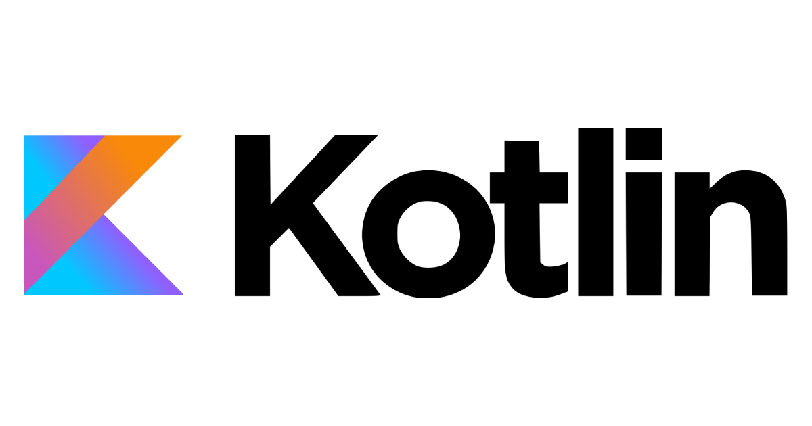

**第二种方式：跨平台开发（Cross-Platform）** 例如 Flutter 或 React Native。主打“写一套代码，同时生成 Android 和 iOS 应用”。

**第三种是“混合开发（Hybrid）”。** 本质上就是在 App 的壳子里套了一个网页浏览器。这种方式开发速度快，但体验和流畅度通常不如原生 App，很难做出一款精致的、有沉浸感的小工具。

**本教程的选择：以原生开发（** **Kotlin + Compose）**为基础，结合 AI 工具完成编码。 原因很简单：原生开发的 Jetpack Compose 代码结构非常清晰，极度适合 AI 理解和生成。我们不需要从零手写代码，而是通过自然语言指挥 Trae 生成高质量的原生代码。


## 1.4 本文介绍的 Android App 开发步骤

为了让整个学习过程不再枯燥，本教程将全程围绕一个既解压又包含核心技术的案例—— **《电子木鱼》** 展开。我们将结合 Trae 的 Vibe Coding 模式，把从零开始到真机运行的过程，拆解为一条你可以反复复用的路线：

1. **建立认知与环境** 弄清楚 Android App 的形态，安装好 Android Studio 和 Trae，并配置好国内镜像源，确保工具链通畅。
2. **搭建项目骨架** 创建一个可以在模拟器中成功运行的空白 Android 项目。
3. **AI 迭代开发** 在 Trae 中打开项目，通过与 AI 的对话，从画出木鱼图片开始，逐步实现敲击动画、播放音效、悬浮文字等功能。
4. **真机调试与打磨** 脱离模拟器，将 App 安装到你的真实手机上，体验真实的震动反馈，并让 AI 协助排查 Bug。
5. **打包与发布** 生成正式的安装包（APK），并了解如何将其发布分享。

这一节只负责把全景图画出来，不展开具体命令。现在只需要记住这条主线： **环境准备 → 骨架搭建 → AI 描述与生成 → 真机打磨 → 打包交付** 。接下来的章节，我们会手把手带你走完每一步。

# 2 开发环境搭建

## 2.1 本教程会用到的工具

整个开发过程我们需要配合使用三个工具，它们分别承担了“设计”、“建造”和“验收”的角色。

- **Trae：** 这是你的 **AI 编程搭子** 。在 Vibe Coding 模式下，我们不再需要一行行手敲代码，而是主要在 Trae 里通过自然语言告诉 AI 想要什么功能，由它来负责生成和修改代码。
- **Android Studio：** 它是 Google 官方提供的 **App 构建工厂** 。虽然它看起来按钮很多，但在本教程中，我们主要用它来创建项目骨架，以及把 Trae 写好的代码“编译”成手机能安装的软件。
- **一台安卓设备：** 作为 **测试终端** 来查看运行效果，可以直接连接电脑进行真机调试，体验真实的震动反馈；如果没有也没关系，Android Studio 自带的 **模拟器 (Emulator)** 可以在电脑上完美模拟一台虚拟手机，足够完成前期开发。

## 2.2 Trae 下载

Trae 是我们进行 **Vibe Coding** 的主战场。你可以把它简单理解为一个 **“内置了超级 AI 的代码编辑器”** 。

请访问官网 [https://www.trae.cn](https://www.trae.cn) ，根据你的电脑系统（Windows 或 Mac）下载对应的版本。安装过程非常简单，和安装普通软件一样，双击安装包并按提示点击“下一步”即可完成。准备好这个工具后，在接下来的实战中，我们就不需要面对枯燥的代码框发呆了，而是直接在这里打开项目，通过对话框用自然语言指挥 AI 帮我们写代码、改 Bug。


## 2.3 Android Studio 下载

我们需要 Android Studio 来提供安卓运行所需的 SDK 和模拟器，请访问官方下载页面[https://developer.android.com/studio?hl=zh-cn](https://developer.android.com/studio?hl=zh-cn)，下载适用于你电脑系统的安装包（本教程基于 **2025.2.3** 版本编写）。下载完成后，像安装普通软件一样双击运行，保持默认选项一路“Next”即可。

**新手特别提醒：**

虽然现代版本的 Android Studio 已经极大简化了配置流程，但它底层依然依赖 **JDK (Java Development Kit)** 环境。如果你是第一次接触开发，或者在安装过程中遇到了“环境变量”或“SDK 配置”相关的报错，请不要慌张。你可以参考下面这篇详细的避坑指南，它会手把手教你完成这些基础配置：[Android Studio2024版本安装环境SDK、Gradle配置](https://blog.csdn.net/keiraee/article/details/142321644?ops_request_misc=elastic_search_misc&request_id=a2b858d1f665095c53afa9114ad8864d&biz_id=0&utm_medium=distribute.pc_search_result.none-task-blog-2~all~top_positive~default-2-142321644-null-null.142^v102^pc_search_result_base4&utm_term=android%20studio%E5%AE%89%E8%A3%85%E5%8F%8A%E9%85%8D%E7%BD%AE&spm=1018.2226.3001.4187)

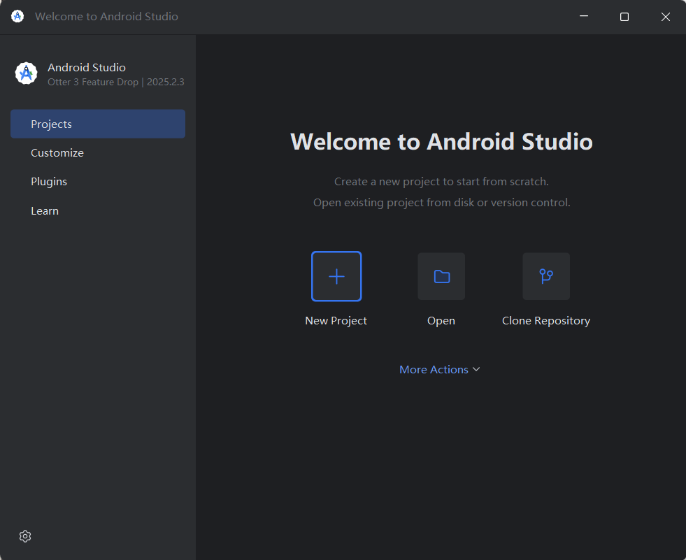

## 2.4 新建一个项目

打开安装好的 Android Studio，点击欢迎页面的 **"New Project"** 按钮。

**第一步：选择模板**

在弹出的模板列表中，请选择 **"Empty Activity"** （注意图标上有 Jetpack Compose 的标志）。

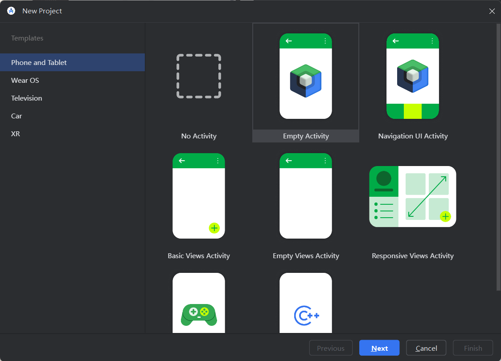

**第二步：填写项目配置**

接下来你会看到一个配置表单，请按照以下建议填写，其余保持默认即可：

| **字段**          | **推荐值**                                         | **说明**                                 |
| ----------------- | -------------------------------------------------- | ---------------------------------------- |
| **Name**          | My Application 1                                   | 应用名称，会显示在手机桌面上             |
| **Package name**  | com.example.myapplication1                         | 应用唯一标识符，不可重复                 |
| **Save location** | 自定义路径（如 E:\AndroidProjects\Myapplication1） | 项目保存位置，不推荐放在C盘              |
| **Minimum SDK**   | API\*\*\*\*30                                      | 覆盖超 90% 现役设备，平衡兼容性与功能    |
| **Language**      | Kotlin（推荐）                                     | Kotlin是 Google 官方推荐语言，更简洁安全 |


**第三步：等待构建**

点击 **"Finish"** 按钮。此时 Android Studio 会开始自动下载依赖并构建项目（右下角会有进度条）。

- _注意：第一次创建项目可能需要几分钟时间，请耐心等待，直到底部的进度条走完，且左侧的项目文件目录加载出来，才算创建成功。_

## 2.5 依赖配置：Gradle下载和GradleRepository依赖库下载

> 这是 Vibe Coding 流程中为数不多建议**手动操作**的环节。虽然 AI 也能帮我们修改配置，但环境配置涉及到底层文件的读写，手动修改最为稳妥。

为什么我们需要修改配置呢？

之所以要执行这一步，是因为 Android Studio 默认连接的是国外服务器，下载构建工具和依赖库可能耗时一小时甚至失败；而更改为国内镜像源后，通常只需几分钟即可完成。**这是一次性的工作，配置一次，受益终身。**

1. **准备工作**

如果你的 Android Studio 右侧底部状态栏正在显示下载进度条（Gradle Building...），请根据下图操作暂停正在下载的依赖，避免文件冲突。

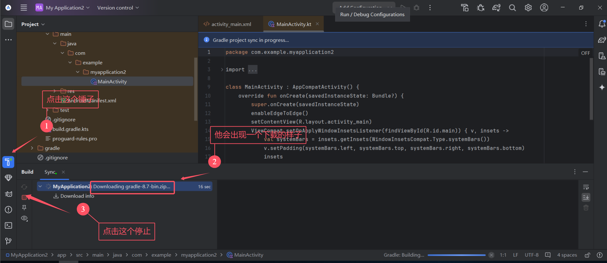

2. **加速 Gradle 构建工具下载**

在左侧项目文件目录中，依次展开 `gradle` -> `wrapper`，双击打开 `gradle-wrapper.properties` 文件。 将下载源更改为腾讯镜像源，如下：

```
distributionUrl=https\://mirrors.cloud.tencent.com/gradle/gradle-8.7-bin.zip
```

切记，只需要把[services.gradle.org/distributions](http://services.gradle.org/distributions)替换成[mirrors.cloud.tencent.com/gradle](https://mirrors.cloud.tencent.com/gradle/)就行了，其余地方不要动

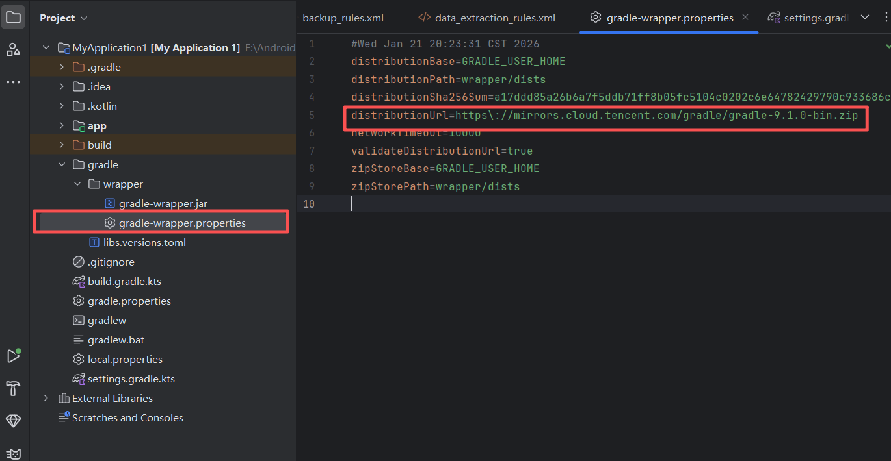

3. **加速依赖库下载**

接着，在左侧目录的根节点下找到并打开 `settings.gradle.kts` 文件。，请将 `repositories` 大括号内的内容替换为以下代码：


将上图框起来部分都替换成以下代码（这是2025年2月21日最新更新的源）

```JSON
        // 阿里云镜像（覆盖 Maven Central、Google、JCenter 等）
        maven { setUrl("https://maven.aliyun.com/repository/public/") }
        maven { setUrl("https://maven.aliyun.com/repository/google/") }
        maven { setUrl("https://maven.aliyun.com/repository/jcenter/") }
       maven { setUrl("https://maven.aliyun.com/repository/gradle-plugin/") }
        // 华为云镜像
        maven { setUrl("https://repo.huaweicloud.com/repository/maven/") }
        // 腾讯云镜像
        maven { setUrl("https://mirrors.cloud.tencent.com/nexus/repository/maven-public/") }
        // 网易镜像
        maven { setUrl("https://mirrors.163.com/maven/repository/maven-public/") }
```

变成如下图的样子


4. **保存应用更改**

到了这一步我们记得保存一下，然后点击右上角的那个 `Try Again`，软件会重新开始下载配置。耐心等待几分钟，当底部控制台出现 `BUILD SUCCESSFUL`字样时，说明环境搭建彻底成功，我们已经准备好开始写代码了。


## 2.6 理解项目结构

项目创建成功后，左侧会出现 **Project** 面板。切换为 **Android** 视图（默认），你会看到如下关键目录：

```
app/
├── manifests/
│   └── AndroidManifest.xml            ← 应用“身份证”， 声明应用名、入口 Activity（MainActivity）
│
├── java/
│   └── com.example.myapplication1/
│       ├── MainActivity.kt            ← 应用入口，使用 Jetpack Compose 构建界面
│       │
│       └── ui/                        ← 控制整体 UI 风格（颜色、字体）
├── res/
│   ├── drawable/                      ← 图片资源（如 ic_launcher.png）
│   ├── mipmap/                        ← App 图标
│   ├── values/                        ← 存放文字、颜色、主题样式
│   │   ├── colors.xml
│   │   ├── strings.xml
│   │   └── themes.xml
│   └── xml/                           ← 系统功能相关的配置文件目录（非界面
└── build.gradle (Module: app)         ← App 的构建配置（初学阶段基本不用改）
```

我们作为初学者，通常只需要关注三个文件即可

- `MainActivity.kt`：控制程序行为、决定“屏幕上显示什么”
- `AndroidManifest.xml`：注册组件、决定“应用从哪里启动”
- ` Theme.kt`：定义界面外观

# 3 Android App 开发

在前两章，我们已经搞清楚了 Android App 是什么，并把 Trae 和 Android Studio 这两把“神兵利器”磨得锃亮。从这一节开始，我们不再纸上谈兵，而是正式进入实战环节。我们将采用 Vibe Coding 模式，从零打造一款当下非常流行的解压应用—— **“电子木鱼” (Electronic Wooden Fish)** 。它不仅符合“Vibe”的主题（解压、简单），而且涵盖了安卓开发的三个核心要素：**UI交互（点击）、数据存储（功德数）、多媒体（音效）** 。

接下来，请跟随我的节奏，向 AI 发出第一道指令。

## 3.1 第一次“总指令”：从零到一

在 Vibe Coding 模式下，我们不需要像传统开发那样先创建布局文件、再写逻辑代码。我们要做的，是 **一次性把需求描述清楚，让 AI 帮我们生成第一版可运行的雏形** 。

在 Trae 中打开我们刚才创建的项目目录，在右侧的聊天框（Chat）中，输入下面这段 Prompt（提示词）：

```
你是一个资深的 Android 开发专家。 请帮我把当前的 MainActivity.kt 重写，把它变成一个“电子木鱼”应用。 需求如下：
1. 屏幕背景是黑色。
2. 屏幕正中间显示一个木鱼的图案，大小适中，颜色为白色。
3. 图片上方显示一行白色的文字：“功德：0”。
4. 点击中间的木鱼时，数字加 1，并产生一个简单的缩放动画效果（模拟敲击感）。
5. 使用 Jetpack Compose 编写。
```

发送指令后，你会看到 Trae 开始思考并分析你的项目结构。几秒钟后，它会直接生成 `MainActivity.kt` 的完整代码。

1、通过它的回答，我们可以看到他的思考逻辑，交互逻辑等等

2、我们可以直观的看到他对哪些代码进行了改写

3、如果我们对生成的效果不满意，我们可以回退到上一个版本

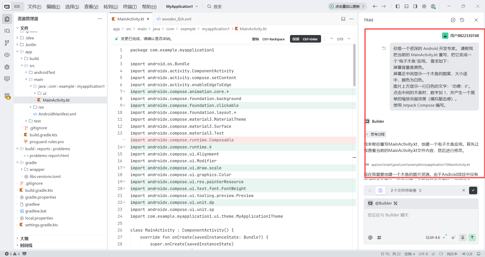

## 3.2 运行与查看（模拟器调试）

此时 AI 已经完成了第一轮开发，但请记住，在 Trae 中我们看到的只是一堆代码“图纸”，而非可以点击交互的真实 App。Trae 无法直接运行安卓应用，因此我们需要借助 Android Studio 提供的 **模拟器（Virtual Device）** 。它就像是把你电脑屏幕变成了一台虚拟的安卓手机，让我们能立刻把刚才的代码“安装”进去，查看到真实的运行效果。

接下来，我们来配置这台“虚拟手机”。

**第一步，创建模拟器**

回到 Android Studio，在右侧工具栏找到并点击 **"** **Device Manager** **"** （设备管理器）。如果没找到，可以通过顶部菜单栏 `View` -> `Tool Windows` -> `Device Manager` 调出。

在面板中点击“Add a new device” 按钮选择创建 “Create Virual device”，进入设备选择窗口。

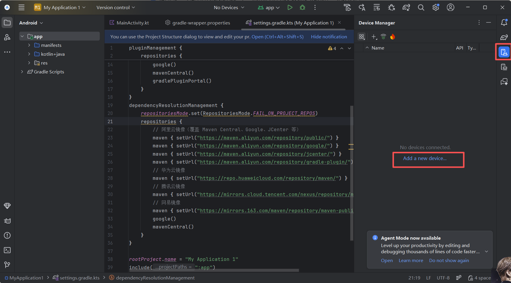


在弹出的硬件选择窗口中，选择 “Phone”（手机） 分类下的 “Smart Phone”（中等屏幕手机） 选项（也可根据需求选择其他分辨率的设备，如 “Pixel” 系列），点击 “Next”。


**第二步：配置系统镜像**

进入 “System Image”（系统镜像）对话框，在列表中选中 “API 36.1” 系统版本（若该版本未下载，右侧会显示 “Download”按钮，点击按钮下载镜像文件，下载完成后再选中），点击 “Finish”。

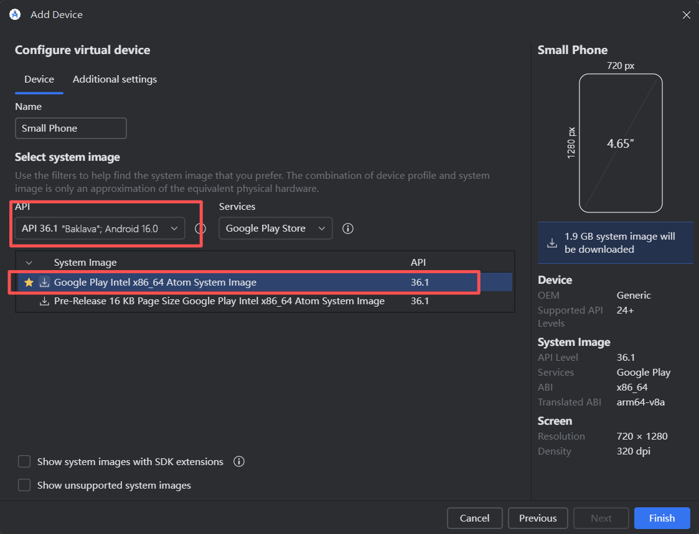

**第三步：启动模拟器**

创建成功后，你的设备管理器列表中会出现刚刚添加的手机。点击它右侧的 **三角形播放按钮** 。 稍等片刻，一个外形像真实手机的窗口就会弹出来。这就是你的安卓模拟器。

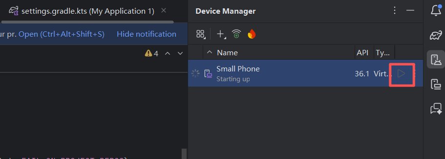


**第四步：运行 App**

现在是见证奇迹的时刻。 确保模拟器已经启动并显示桌面，点击 Android Studio 顶部工具栏那个醒目的 **绿色三角形运行按钮** （或直接按快捷键 `Shift + F10`）。 软件会自动开始编译，把 Trae 写好的代码打包成 App，并自动安装到模拟器里。

几秒钟后，你应该能看到模拟器屏幕亮起，中间出现了一个白色的木鱼图案，上方显示着“功德：0”。试着点击它，看看数字是否增加，动画是否生效。这就是你的第一个 Android App！

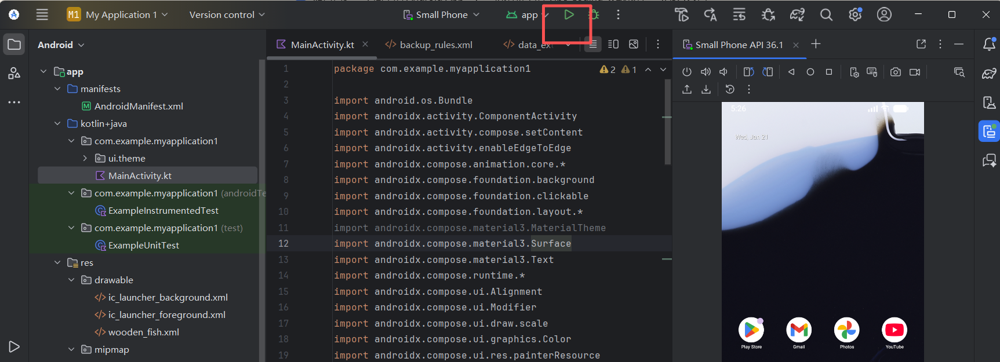

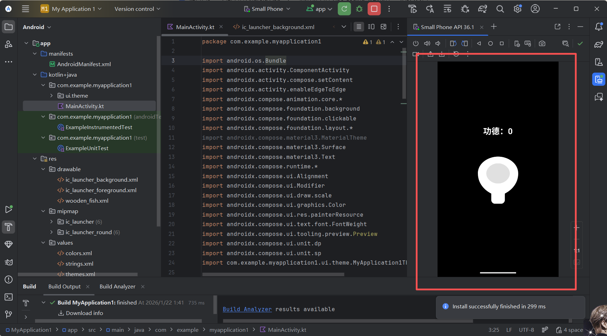

## 3.3 优化迭代（添加素材与音效）

此时，我们的 App 已经具备了雏形：点击屏幕，数字增加。但它现在还只是一个“哑巴”的白色几何体，缺乏使用的乐趣。接下来，我们将通过添加真实的图片和敲击音效，让这个电子木鱼变得沉浸感十足。

**这正是 Vibe Coding 模式最迷人的地方。** 在传统开发中，添加音效和复杂动画往往是新手的噩梦。你不仅要处理 `MediaPlayer` 的资源加载与释放（否则会导致内存泄漏），还要计算动画的贝塞尔曲线。但在 Vibe Coding 模式下，这些底层技术细节你完全不需要关心，你只需要像导演一样告诉 AI：“把道具换一下，点击时加个声音”，复杂的代码实现瞬间就能完成。

**第一步：准备素材** 你需要准备一张木鱼图片（png格式）和一段敲击音效（mp3格式）。

- **图片素材** ：将准备好的 `white_muyu.png` 复制到项目目录的 `app/src/main/res/drawable` 文件夹中。
- **音频素材** ：在 Android Studio 左侧的项目视图中，右键点击 `res` 文件夹，选择 New -> Android Resource Directory，在弹出的窗口中资源类型选择 **raw** ，点击确定。然后将 `voice.mp3` 复制到这个新建的 `res/raw` 文件夹里。 _(注：如果涉及商用发布，请务必确保你使用的素材拥有合法的版权授权。)_

这是我为您找的图片和声音素材，如果您不便于去寻找相关素材可以直接使用


敲击音效下载链接 https://www.aigei.com/s?q=%E6%9C%A8%E9%B1%BC&type=sound，选择第一个1s的音效即可


**第二步：下达迭代\*\***指令\*\*

素材就位后，回到 Trae。Trae 会再次修改代码，帮你处理复杂音频加载和动画逻辑，只需要告诉它我们要用哪些素材，将以下 Prompt 输入对话框：

```
我已经把素材放进去了：图片路径是 res/drawable/white_muyu.png，声音特效路径是res/raw/voice.mp3，请帮我更新代码：
1. 把中间的木鱼图标换成我的木鱼图片。
2. 每次点击木鱼时，播放敲击音效。
3. 点击时，在木鱼上方出现一个暂时的文字 "+1"，然后慢慢飘走消失（类似游戏里的跳字效果）。
```


**第三步：验收成果**

等待 Trae 修改完代码后，回到 Android Studio，点击顶部的绿色运行按钮（Re-run），重启模拟器。 此刻，你的应用已经脱胎换骨。试着连续点击，你应该能听到清脆的“笃笃”声，看到“功德+1”的文字在鼠标下跳跃。这就完成了从“Demo”到“产品”的关键跨越。

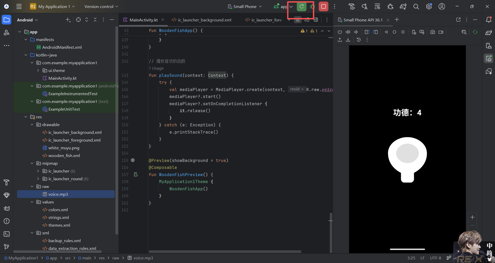


## 3.4 遇到 Bug 怎么办？（与 AI 的调试闭环）

AI 生成的代码不一定一次就完美，就像顶尖的程序员也无法保证一次写出无 Bug 的代码。但请放心，在 Vibe Coding 模式下，Bug 不再是阻碍你的高墙，而是你和 AI 磨合的垫脚石。

**情况一：程序崩了（报错闪退）**

假设你点击运行后，App 直接闪退，或者点击木鱼没有声音。在传统做法中，你需要去搜索引擎查报错代码，浏览几十个技术论坛，在一堆看不懂的英文中寻找解决方案，耗时往往以小时计。而在Vibe Coding 做法中，你只需要做一件事—— **当个“搬运工”** 。

**操作步骤：**

1. **打开日志** ：在 Android Studio 底部找到 **"** **Logcat** **"** 窗口（一只可爱的小猫图标）。
2. **定位错误** ：你会看到很多滚动的日志，其中**红色的文字**就是报错信息。
3. **复制粘贴** ：选中那段红色的英文，直接复制，然后扔给 Trae：“我运行报错了，这是错误信息，请帮我修复。”
4. AI 会立刻告诉你：“哦，是因为忘记在 `AndroidManifest.xml` 中申请震动权限了”，并直接给出修复后的代码。你只需要点击 Apply，问题解决。

**情况二：体验不好（逻辑优化）**

有时候程序没报错，但用起来不爽。 比如现在的木鱼，你狂点屏幕时可能会发现：新的“+1”动画出不来，感觉必须等上一个“+1”完全飘走消失了，才能触发下一个。 这会导致手感非常卡顿，不能畅快地积攒功德。你不需要自己去研究复杂的“多线程”或“动画队列”逻辑，你只需要把你的“不爽”准确地描述给 AI。

请将以下这段“高阶指令”发送给 Trae：

```
请修改当前的动画逻辑，解决“快速点击不触发”的问题。
当前问题： 现在似乎只有一个动画状态，导致我必须等上一个“+1”完全消失后，点击才有反应。
修改要求：
1.请把动画状态改为使用 mutableStateListOf 来维护一个列表，而不是单个变量。
2.每次点击木鱼时，不管上一个动画有没有结束，都立刻往列表里添加一个新的“+1”实例（包含独立的 ID 和初始位置）。
3.界面上遍历这个列表，让每一个“+1”都独立执行“上浮+淡出”的动画。
4.当某个“+1”的动画执行完毕后，自动把它从列表中移除，防止内存泄漏。
请直接给出修改后的 MainActivity.kt 代码。
```


## 3.5 最终成果展示

在前面的步骤中，我们已经完成了一个能听、能看的电子木鱼。为了让它更接近发布级的 App，我们将通过最后一轮迭代，为它加上“触感”和“个性化”功能。们将实现两个核心需求：一是 **震动反馈** ，让每一次敲击都能得到手机马达的物理响应，极大增强沉浸感；二是 **自定义功能** ，允许用户修改屏幕上的文字，比如将“功德+1”改为“工资+1”或者“烦恼-1”，让这个 App 变得既能许愿也能解压。

请将下面这段精心设计好的 Prompt 发送给 Trae，它会一次性帮你搞定弹窗逻辑、数据切换和硬件调用：

```
角色设定：你是一个 Android Jetpack Compose 开发专家。
任务：请在现有代码基础上，为电子木鱼 App 增加“自定义文案”和“震动反馈”功能。
具体需求如下：
1. 震动反馈 (Haptic Feedback)
每次用户点击木鱼时，除了播放声音和动画外，请调用手机的震动反馈（使用 LocalHapticFeedback.current），给用户一个轻微的触觉响应。
2. 自定义文案功能 (UI与交互)
入口：在主页上方显示的“功德 +1”文字旁边，添加一个小的编辑图标（可以使用 Icons.Default.Edit）。
弹窗逻辑：点击图标后，显示一个对话框（Dialog/AlertDialog）。
    弹窗标题：显示“修改内容”。
    输入框：允许用户输入想要积攒的功德名称（默认值为“功德”）。
    数值选择：在输入框下方提供两个选项（可以使用单选按钮 RadioButton 或 切换开关），让用户选择是“+1”还是“-1”。
    保存按钮：点击“保存”后，弹窗消失，并将用户的设置应用到主页。
    数据刷新：如果用户更新了内容，那么主页上方的统计数值清0，从0开始重新计数
3. 效果更新
保存后，主页顶部的统计文字和点击木鱼时飘出的浮动动画文字，都需要变成用户自定义的格式。
    飘起来的文字字体大小不要超过主页顶部的统计文字的字体大小
    例如用户输入“工资”并选择“+1”，点击木鱼时主页顶部的统计逻辑就是+1，同时飘出“工资+1”
    用户输入“烦恼”并选择“-1”，点击木鱼时主页顶部的统计逻辑就是-1，同时飘出“烦恼-1”。
4. 技术要求：
请确保新的状态（文字和数值）能正确影响到动画效果。
请直接给出修改后的 MainActivity.kt 完整代码，保持之前的动画和音效逻辑不变。
```

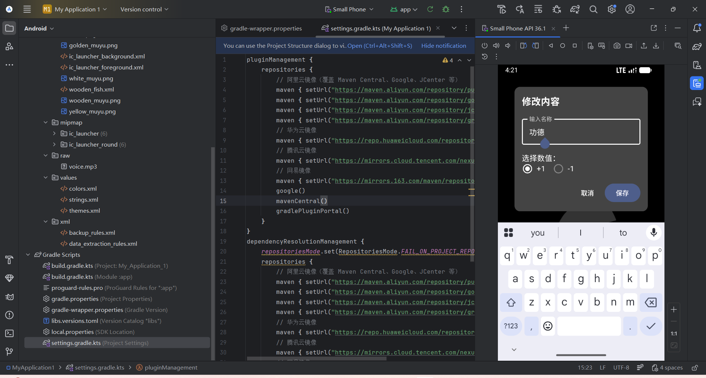

# 4 真机调试与打磨

模拟器虽然方便，但它无法模拟真实的手机震动（触感反馈），也无法完全还原真实的触摸延迟。为了获得最准确的“手感”，我们需要把 App 安装到真实的安卓手机上。下面我们将介绍两种连接方式，你可以根据实际情况选择：

1. **无线调试 (Wi-Fi)** ：无需数据线，连接方便，适合日常快速查看。但要求电脑和手机必须在**同一个 Wi-Fi 网络**下。
2. **USB有线调试** ：传输稳定，不易断连，适合网络环境差或初次安装失败的情况。

## 4.1 无线调试

这是 Android 11 及以上版本最便捷的方式。

**第一步：手机端准备**

1. 确保手机和电脑连接的是 **同一个 Wi-Fi** 。
2. 进入【开发者选项】，找到并开启 **【无线调试】** 开关。
3. 点击【无线调试】文字进入详情页，选择 **【使用二维码配对设备】** ，此时手机会打开扫描框。


**第二步：电脑端配对**

1. 回到 Android Studio，点击顶部工具栏的设备选择器（显示模拟器名字的地方）。
2. 在下拉菜单中选择【Pair Devices Using Wi-Fi】。
3. 屏幕上会弹出一个二维码。

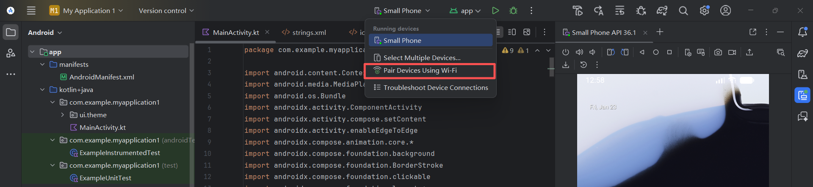

**第三步：扫码连接**

1. 用手机扫描电脑屏幕上的二维码。
2. 手机和电脑会同时提示“配对成功”。
3. 此时，Android Studio 顶部的设备栏中会自动显示你的手机型号（例如 `Google Pixel 8`）。

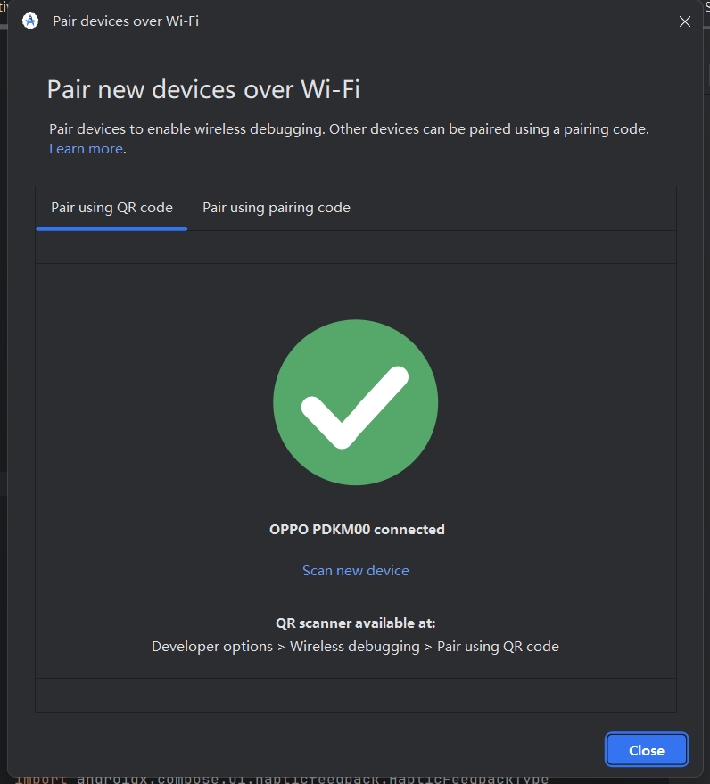

4. 运行设备：点击 ▶️ 运行


## 4.2 usb有线调试

如果无线连接不稳定，或者你的网络环境比较复杂，那么“插线”永远是最可靠的方案。虽然有一根线的束缚，但它的传输速度最快，几乎不会出现断连的情况。

### 4.2.1 Android Studio中安装Usb驱动准备（仅 Windows 用户）

Mac 用户请直接跳过这一步，插上手机即可识别。 Windows 用户需要确保电脑能“认识”你的安卓手机，这通常需要安装 Google USB 驱动：

1. 在 Android Studio 中，点击顶部菜单的 Tools -> SDK Manager（或者在 Settings -> Languages & Frameworks -> Android SDK 中找到）。
2. 切换到中间的 **SDK Tools** 选项卡。
3. 在列表中勾选 **Google USB Driver **，点击 **Apply** 进行下载和安装。

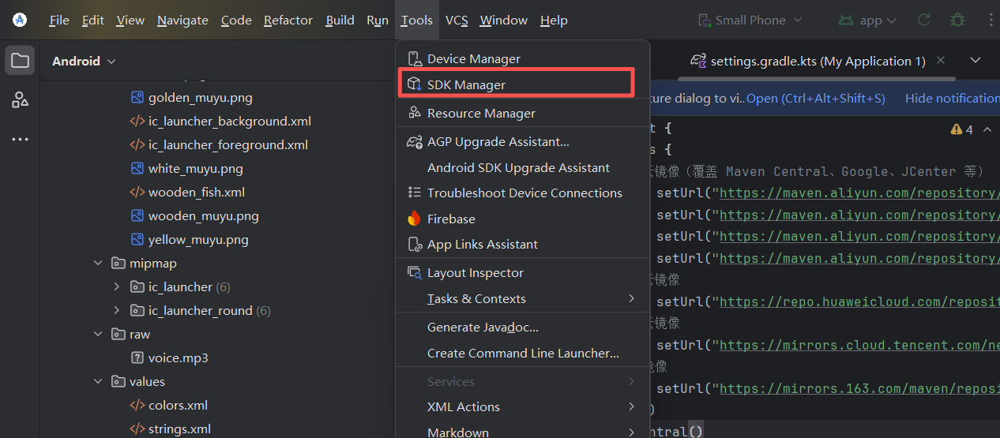


### **4.1.2 下载和真机一样版本的SDK**

**第一步，查看手机Android版本**

这里以oppo手机为例：打开设置---点击关于本机---查看你的安卓版本（示例中为Android 12）

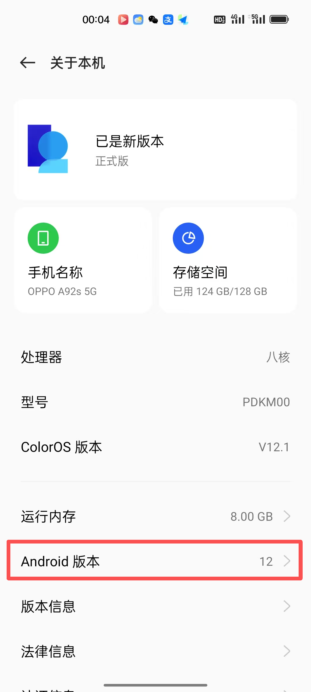

**第二步，选择你安卓手机的安卓系统版本进行下载**

1. 在 Android Studio 中，点击顶部菜单的 Tools -> SDK Manager（或者在 Settings -> Languages & Frameworks -> Android SDK 中找到）。
2. 默认为中间的**SDK Platforms**选项卡。
3. 选择Android 12.0 点击apply进行下载


### 4.1.3 打开手机开发者模式

打开手机设置，进入开发者选项，找到并开启 **【** **USB** **调试**】 开关。

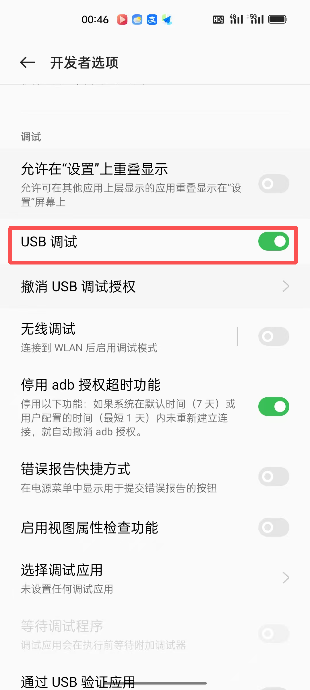

### 4.1.4 系统中安装Usb驱动

此时，拿起你的手机，屏幕上应该会弹出一个重要的安全警告框：“允许 USB 调试吗？”。 请务必勾选 “始终允许”，然后点击“允许”或“确定”。这是电脑获得手机控制权的关键授权。

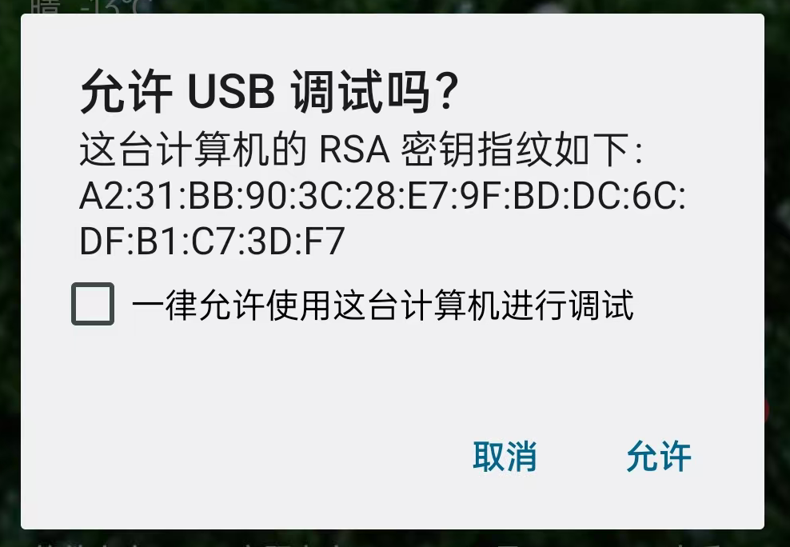

### 4.1.5 在我们的手机中运行APP

1. 在 Android Studio 顶部设备选择器中，应能看到我们的手机型号（如 “OPPO-PDKM00”）。
2. 点击 ▶️ 运行，手机会弹出“允许 USB 调试吗？”对话框，勾选“始终允许”并点击确定。
3. 应用将自动安装并启动。

现在，试着点击屏幕上的木鱼，感受一下那来自真实物理马达的震动反馈，这才是 Vibe Coding 的最终完全体体验。

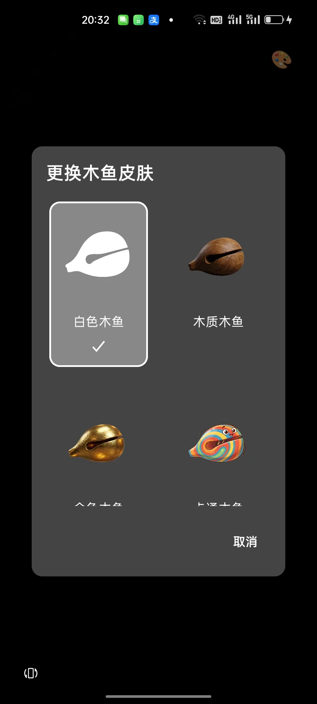

# 5 将APP打包APK

代码写完了，真机也跑通了，现在我们需要把这个 App 从 Android Studio 里面“拿”出来，变成一个可以发送给朋友安装的文件。这个过程就叫 **打包** 。在 Android 开发中，打包分为两种完全不同的模式，我们需要根据使用场景来选择。

## 5.1 打包debug版（快速分享）

如果你只是想把 App 发给身边的朋友尝尝鲜，或者发给测试手机验证功能，那么 **Debug 版** 是最快的方式。它就像是一个“草稿”，虽然功能完整，但没有经过正式的数字签名，无法上架应用商店。

**操作步骤非常简单：** 在 Android Studio 顶部菜单栏中找到 Build，鼠标悬停在 Generate App Bundles or APKs 上，然后在弹出的子菜单中点击 Generate APKs。


接下来等待5秒左右，时长因项目大小而定，就可以在整个AS界面的右下方控制台看到这样的提示框，点击蓝色文字 locate 文件夹会自动弹出，里面那个名为 `app-debug.apk` 的文件，就是我们要的安装包。

你可以直接把它通过微信或 QQ 发送给任何安卓手机，对方接收后即可安装使用。值得注意的是debug并未是发行版。


## 5.2 打包Realse版

如果你想把 App 发布到应用商店（如 Google Play 或华为应用市场），或者希望 App 在安装时不会提示“不安全的应用”，那你就必须打包 **Release 版** 。这个版本需要一个独特的“数字签名”，它就像是你给 App 贴上的防伪封条，证明这个 App 是你开发的，且没有被篡改过。

> 签名的核心作用
>
> - 确定发布者的身份：应用开发者可以通过使用相同包名来替换已经安装的程序，因此使用签名可以避免发生这种情况。
> - 确保应用的完整性：签名会对应用包中的每个文件进行处理，从而确保程序包中的文件不会被替换。

安卓应用的签名类似于“封条”，贴了封条后的应用和开发者一对一“锁定”，即应用是我开发的，我对应用负责；别人无法假冒我，我假冒不了他人。

**第一步：开启签名向导**

在顶部菜单栏选择 Build，这次我们要点击 Generate Signed Bundle / APK。 在弹出的窗口中，你会面临两个选择：

- Android App Bundle (.aab)：这是 Google Play 要求的格式，体积更小，但不能直接安装到手机上。
- APK：这是通用的安装包格式，可以直接安装。 _建议：为了演示方便，这里我们先选择 APK，点击 Next。_

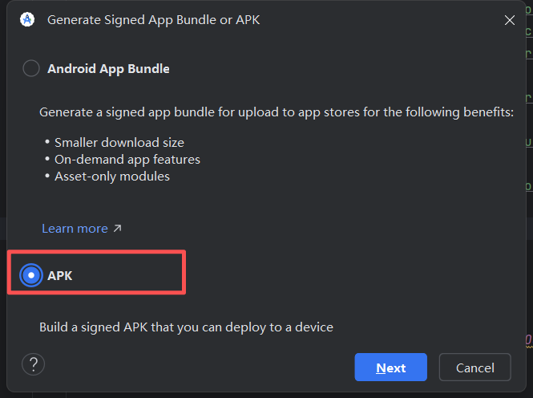

**第二步：创建数字密钥 (KeyStore)**

这是新手最容易卡住的地方。因为是第一次打包正式版，我们需要新建一个“密钥库”。 在 Key store path 下方点击 **Create new** 。


在弹出的窗口中，你需要填写一些信息，就像注册账号一样。这里我们强烈建议密钥库密码和密钥别名密码 **设为一样的** ，并且 **一定要记下来** ！如果密码丢了，你的 App 以后就再也无法更新了。

填写完毕后点击 OK，你会回到上一个界面，此时刚才填好的密钥信息已经自动填充进去了。

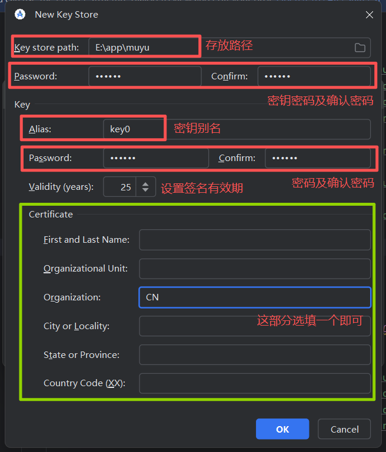

**第三步：生成正式包**

点击 Next，在 Build Variants 中选择 **release** （正式版），最后点击 **Create** 。

等待片刻，当右下角再次弹出“Generate Signed APK”成功的提示时，点击 **locate** 。这次你看到的文件夹里，躺着的就是经过数字签名的正式版安装包（通常名为 `app-release.apk`）。这个文件，才是你作为开发者交付的最终产品。

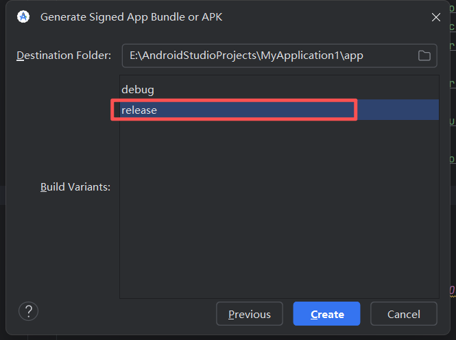

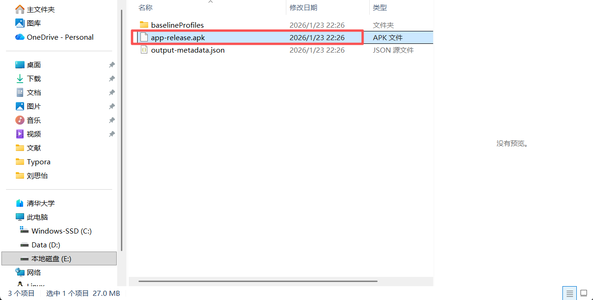

# **6 正式上线到应用商店/市场**

当你的 App 开发完成并打包好 Release 版本后，下一步就是把它发布出去，让更多人下载使用。目前主要的分发渠道分为两类：**国内应用商店**和 **海外应用商店（Google Play）** 。

## 6.1 发布国内市场

国内的安卓生态比较特殊，没有统一的官方商店（因为 Google Play 在国内无法直接访问），而是形成了“手机厂商”和“第三方平台”并存的格局。主流的**手机厂商商店**包括华为、小米、OPPO、vivo、魅族、三星等，由于是系统自带，流量最大；**第三方平台**主要以腾讯应用宝（依托微信和 QQ）、360 手机助手为代表。

### 6.1.1 核心难点：个人开发者的“拦路虎”

在注册账号之前，有一件非常重要的事情必须告知你： **国内市场对个人开发者非常严格** 。

目前，几乎所有国内主流应用商店（华为、小米、OV、应用宝等）在提交应用时，都**强制要求**提供《计算机软件著作权登记证书》（简称“软著”）。

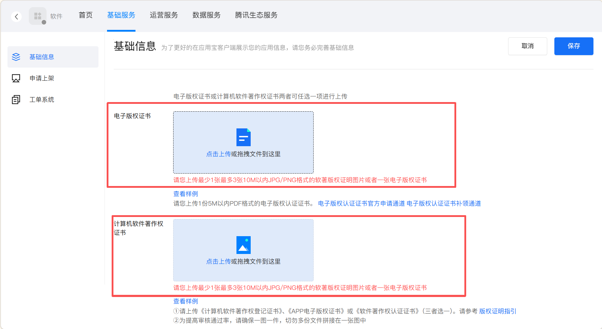

- **什么是软著？** 它是证明 App 归你所有的法律文件。
- **获取成本** ：你需要向版权局申请。自己申请通常需要 2-3 个月，找代理机构加急办理需要花费几百到上千元不等。
- **现状** ：如果没有这个证书，你的 App 大概率无法通过审核，甚至无法创建应用。此外，涉及新闻、金融、医疗等类目还需要 ICP 备案或其他资质。

因此，如果你的 App 只是个人练手或小工具，且不想花费时间和金钱申请软著，我建议直接跳到6.2 节考虑发布到 Google Play，或者直接把 APK 安装包分享给朋友使用。

### 6.1.2 注册开发者账号

如果你已经准备好了资质，或者决心要上架国内市场，第一步是注册账号。各大平台的流程大同小异，通常需要上传身份证（个人）或营业执照（企业）进行实名认证。

这里为大家提供了一些各大应用商店的开发平台网址

腾讯开放平台地址：https://open.tencent.com/

360开放平台地址：http://dev.360.cn

百度开发者平台地址：http://app.baidu.com

小米开放平台网站：https://dev.mi.com

华为开发者联盟地址：http://developer.huawei.com/consumer/cn

阿里开发者平台地址：http://open.uc.cn 阿里应用分发 整合了 豌豆荚、阿里九游、PP助手、UC应用商店、神马搜索，并联合YunOS应用商店等应用分发平台，实现全流量矩阵布局。这里只需要注册一个阿里开发者帐号即可。

三星开发者平台地址：http://support-cn.samsung.com/App/DeveloperChina/Home/Index

OPPO开发者联盟地址：http://open.oppomobile.com

ViVO开发者联盟地址：https://dev.vivo.com.cn

联想开发者联盟地址：http://open.lenovo.com

魅族开发者联盟地址：http://open.flyme.cn

金立开发者联盟地址：https://open.appgionee.com

**以腾讯应用宝为例：** 访问腾讯开放平台，点击注册。建议使用 QQ 账号直接登录。注意，注册用的 QQ 号一旦绑定很难解绑，建议使用专门的工作 QQ。根据页面提示，选择“个人开发者”或“企业开发者”，上传身份证照片并进行人脸识别验证。认证通过后，点击【创建应用】即可开始。

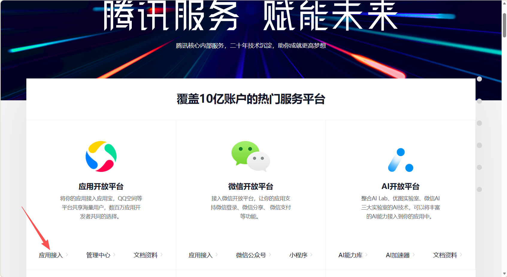

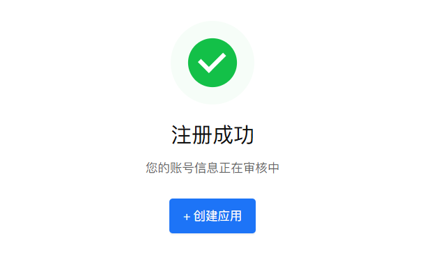

### 6.1.3 发布流程与准备资料

账号审核通过后，你就可以创建应用并提交审核了。你需要准备好以下“四件套”：

1. **安装包** ：即我们在第 5 章打包好的 **Release 版 APK** 。
2. **文案信息** ：
3. **应用名称** ：不能包含敏感词。
4. **一句话简介** ：20 字以内，简明扼要（例如：一款解压的电子木鱼工具）。
5. **详细描述** ：200 字以上，介绍功能点和使用场景。
6. **视觉素材** ：
7. **App 图标** ：高清 PNG 格式（通常为 512x512）。
8. **应用截图** ：准备 4-5 张清晰的 App 运行截图。建议覆盖主要功能页，尺寸保持一致（如 1080x1920）。
9. **资质文件** ：上传你的《软件著作权证书》扫描件。

**提交与审核：** 在后台填写完上述信息并上传 APK 后，点击“提交审核”。通常审核周期在 1-3 个工作日。期间请留意你的邮箱或短信，审核员可能会因为“截图不清晰”、“简介不规范”或“缺乏特定资质”驳回申请，你需要根据反馈修改后再次提交。

## 6.2 发布海外市场（Google Play）

如果你不想被国内应用商店繁琐的“软著”和“备案”折磨，或者你的目标是全球用户，Google Play 是个人开发者最好的选择。

### 6.2.1 事先准备

- **Google 账号** ：普通的 Gmail 邮箱即可。
- **25 美元注册费** ：这是一个**一次性**的费用（终身有效），需要使用支持美元支付的信用卡（Visa/Mastercard）进行支付。
- **科学的网络环境** ：你需要能够顺畅访问 Google Play Console（开发者控制台）。
- **正式版安装包** ：注意，Google Play 强制要求上传 **. aab** ( Android App Bundle ) 格式的文件，而不是 APK。在 Android Studio 打包时选择 "Android App Bundle" 即可，步骤与打包 APK 几乎一致。


### 6.2.2 Google Play Console 发布流程（文字概览）

由于 Google Play 的注册支付存在一定的门槛（需要境外信用卡），本教程目前暂时无法提供实操截图。但我为你梳理了通用的四个核心步骤，这套逻辑在后台是通用的：

**第一步：创建应用 进入控制台**

点击 Create app，填写应用名称（Electronic Wooden Fish），语言选英语，属性选 App 和 Free。勾选协议后，你就拥有了后台管理权。

**第二步：装修店面**

这是用户的“第一印象”。你需要上传之前准备好的 图标 (512x512) 和 置顶大图 (1024x500)。 至于英文介绍，直接让 Trae 帮忙：**“请帮我写一段电子木鱼上架 Google Play 的英文介绍，语气轻松解压。”** AI 写的通常比我们翻译的更地道。

**第三步：隐私与分级**

- 隐私政策：搜索“App Privacy Policy Generator”，生成一个免费链接填进去。
- 内容分级：做一份简单的问卷（有没有暴力、赌博？）。电子木鱼通常会获得“3+”的全年龄分级。

**第四步：上传与发布**

在 Production（正式版） 菜单下，点击 Create new release，上传你的 .aab 文件。点击保存并提交审核。Google Play 的审核通常非常快（1-3 天），通过后你的 App 就能被全球用户下载了。

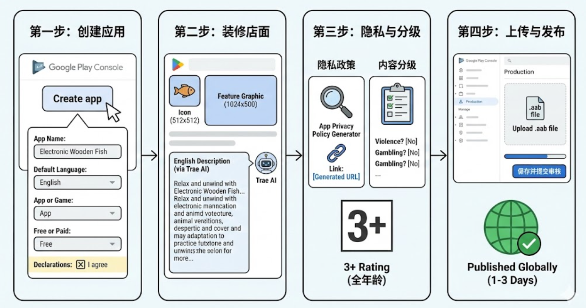

_若您已经完成开发者账号注册，该视频教程可指导您完成后续操作 ：_[Android应用上传GooglePlay谷歌市场全流程教程](https://www.bilibili.com/video/BV16REQzGEnk/?share_source=weixin&vd_source=b42f227a4f2d413fbde18499d83227cf)\*

# 7 写在最后

好了，教程到这里就结束了。看着手机上自己亲手做出来的“电子木鱼”，不知道你现在心情如何?

作为一名软件工程科班出身的“码虫”，在 AI 快速发展的当下，其实我挺感慨的。在过去，学校里啃的是厚厚的编程书，学的是各种复杂的语法，练的是怎么配置环境，每天有大半的时间都在和红色的报错做斗争。而现在，时代变了，我们更多是在学习如何操控 AI。

通过这次 Vibe Coding 实战，你已经体验到整个安卓应用开发的全过程。技术门槛确实在降低，我们不再需要死磕枯燥的代码，而是可以把更多的精力放在"做什么"上。但工具再强终究也只是工具，别让这个 App 在手机里吃灰，试着去折腾它，改坏了再修好；只有当你开始有自己的想法，并且动手去实现它的时候，你才算真正跨进了这个门槛。

如果这个教程能够帮助到你，让你觉得"原来做个 App 也没那么难”，那么我很荣幸能够让开发界又多了一位新生代。

很期待你的下一个作品，加油！


**_祝你在 Android 开发的世界里，玩得开心！_**

# 参考文档

CSDN：[（2024.03.04）如何打包Android Studio项目？](https://blog.csdn.net/GenuineMonster/article/details/136443130?ops_request_misc=&request_id=&biz_id=102&utm_term=android%20studio%20%E6%89%93%E5%8C%85%20APK%20%E5%B9%B6%E5%88%86%E4%BA%AB&utm_medium=distribute.pc_search_result.none-task-blog-2~all~sobaiduweb~default-1-136443130.142^v102^pc_search_result_base4&spm=1018.2226.3001.4187)

CSDN：[Android Studio安装及配置](https://blog.csdn.net/Changersh/article/details/149838228?ops_request_misc=&request_id=&biz_id=102&utm_term=android%20studio%E5%AE%89%E8%A3%85%E5%8F%8A%E9%85%8D%E7%BD%AE&utm_medium=distribute.pc_search_result.none-task-blog-2~all~sobaiduweb~default-0-149838228.142^v102^pc_search_result_base4&spm=1018.2226.3001.4187)
