# iOS Development

## 第 1 章：什么是 iOS App 和 iOS App 开发

在这篇教程中，我们将完整跑通一条闭环：**从脑海中的一个想法，到在 iPhone 上可以成功安装并运行的真实 iOS 应用。**

本次教程，你至少需要具备：

1. 一台运行较新 macOS 的 Mac
2. 一台运行较新 iOS、并已开启开发者模式的 iPhone
3. 已成功安装 Xcode
4. 已安装并打开 Trae
5. 一个可用的 Apple ID


### 1.1 iOS App

iOS App 是运行在 iPhone 操作系统上的原生应用程序，它启动速度快、交互流畅，并且可以深度使用通知、相机、本地存储等系统功能。

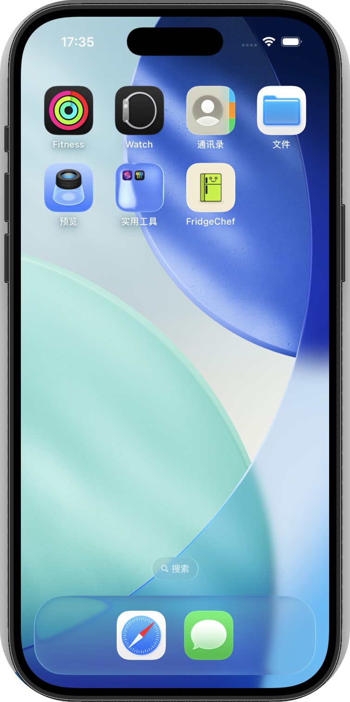

### 1.2 iOS App 开发

开发一个 iOS App，核心只包括几件事：

1. 明确应用要解决的问题
2. 设计用户能看到和操作的界面
3. 定义不同操作下应用的行为
4. 将应用正确构建并安装到 iPhone 上

### 1.3 iOS App 开发的几种常见方式

在实际开发中，iOS App 并不只有一种实现方式。这里不做深入展开，只给出一个整体认识。

第一种方式，是使用 Apple 官方推荐的原生开发方案，通过 Xcode 创建项目，使用 Swift 和 SwiftUI 编写界面和逻辑。


第二种方式，是使用跨平台框架，例如 React Native、Flutter 等，通过一套代码适配多个平台。

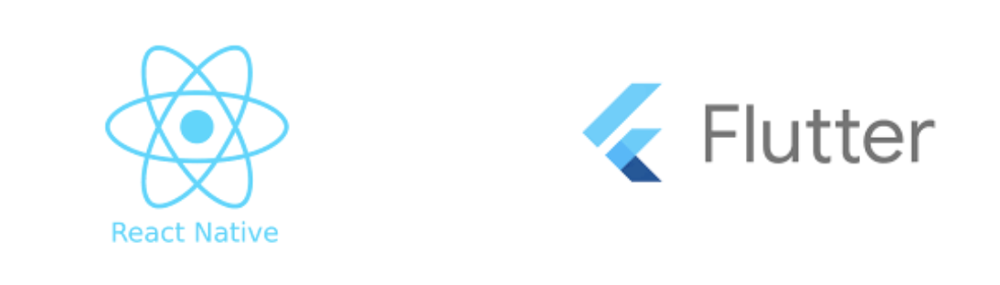

基于以上方式，本教程选择的是： **以 SwiftUI 原生开发为基础，结合 AI 工具完成主要编码工作** 。

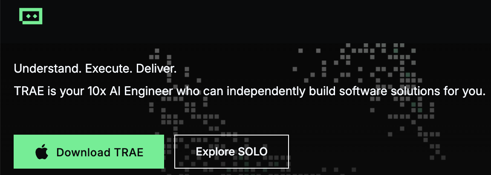

### 1.4 本文介绍的 iOS App 开发步骤（粗略预览）

本教程使用的示例 App 是「冰箱大厨（FridgeChef）」。

用户输入冰箱中现有的食材，应用会通过真实的 AI 接口生成一份可行的菜谱，并将结果保存到本地，方便后续查看。该示例完整覆盖了一个真实 iOS 应用所需的核心组成部分，包括界面输入与展示、网络请求、数据解析、本地存储，以及最终在真机上的安装与运行。


- 从原型到原生的整体思路

在具体实现上，本教程采用分阶段推进的方式。我们会先借助 AI 使用 HTML 和 CSS 快速生成界面原型，在浏览器中确认布局结构和信息层级。

- 整体开发流程预览

整体上，后续章节将依次经历以下几个阶段：

1. 建立基础认知
   弄清楚 iOS App 的形态、常见开发方式，以及本次示例应用解决什么问题。
2. 完成环境准备
   准备一台 Mac 和一台 iPhone，升级系统版本，安装 Xcode 和 Trae，并创建一个可以在模拟器中成功运行的基础 iOS 项目。
3. 进入正式开发
   在 Trae 中打开项目，通过与 AI 的对话，逐步生成界面布局和基础交互，让应用从空壳变成可用。
4. 调试与整理
   当出现编译错误或行为不符合预期时，让 AI 协助排查问题；当结构开始变乱时，借助 AI 进行重构和简化。
5. 真机运行
   配置签名，把应用安装到真实的 iPhone 上，完成一次从代码到设备的完整验证。

## 第 2 章：开发环境准备

### 2.1 必须准备的设备与系统

在这次实践中，有两样硬件是不可替代的：一台 Mac 电脑，以及一台 iPhone。
同时，这两台设备都需要运行 **较新的正式系统版本** 。

#### 2.1.1 Mac 电脑

iOS 应用只能在 macOS 系统上进行开发和编译，这是 Apple 平台的硬性规定。

为了确保 Xcode 可以正常安装和使用，建议在开始前将 macOS 升级到较新的正式版本。你可以在「系统设置 → 通用 → 软件更新」中查看并完成升级。


#### 2.1.2 iPhone 真机

除了 Mac，本教程还需要一台 iPhone 真机，用于验证应用是否能够被系统正常安装和启动。

为保证调试过程顺利，iPhone 需要运行较新的 iOS 版本。你可以在「设置 → 通用 → 软件更新」中查看并完成升级。


后续在开发过程中，这台 iPhone 将通过数据线与 Mac 连接，用于真机调试。

#### 2.1.3 在 iPhone 上开启开发者模式

为了能够在真机上安装和运行来自 Xcode 的调试应用，需要在 iPhone 上开启开发者模式。

开启步骤如下：

1. 打开「设置」
2. 进入「隐私与安全」
3. 滑动到页面底部，找到「开发者模式」
4. 打开开关，并按提示重启设备
5. 重启后解锁设备，确认启用开发者模式


如果你的 iPhone 之前从未连接过 Xcode 或其他开发工具，可能会出现「在『隐私与安全』中找不到开发者模式」的情况。这并不是系统问题，而是因为开发者模式尚未被系统激活。

此时可以通过以下方式触发开发者模式的显示：

1. 打开「设置」→「隐私与安全」→「分析与改进」
2. 打开「与开发者共享」
3. 返回上一级设置页面，再次进入「隐私与安全」，向下滑动到页面底部
4. 此时即可看到「开发者模式」选项，按提示开启并重启设备

完成以上操作后，开发者模式只需开启一次，后续使用 Xcode 进行真机调试时无需重复配置。


### 2.2 必须安装的软件

在设备和系统准备完成之后，还需要安装用于开发的相关软件。本教程只会用到两类工具：iOS 官方开发工具，以及 AI 辅助开发工具。

#### 2.2.1 Xcode

Xcode 是 Apple 官方提供的 iOS 开发工具。在本教程中，它主要用于创建 iOS 项目、编译 Swift / SwiftUI 代码，以及将应用运行到模拟器或真机上。

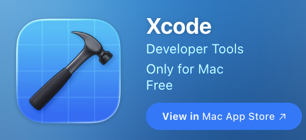

Xcode 可以直接在 App Store 中搜索并安装。安装完成后，首次打开会看到欢迎界面，后续创建项目将从这里开始。


#### 2.2.2 Trae

Trae 是本教程中进行主要开发工作的环境。你会把整个 iOS 项目放在 Trae 中，通过对话的方式与 AI 协作完成开发。


### 2.3 Apple ID 与开发调试说明

在 iOS 平台上，应用要安装到真机上，必须经过开发者签名。本教程不需要付费加入 Apple Developer Program，准备好个人 Apple ID即可。

### 2.4 进入下一步前的状态确认

在进入下一章之前，可以对照下面的清单，确认当前环境已经准备完成。

你现在应该已经具备：

1. 一台运行较新 macOS 的 Mac
2. 一台运行较新 iOS、并已开启开发者模式的 iPhone
3. 已成功安装 Xcode
4. 已安装并打开 Trae
5. 一个可用的 Apple ID

如果以上条件都满足，就可以继续创建并运行你的第一个 iOS App。

## 第 3 章：创建第一个 iOS 项目

### 3.1 使用 Xcode 创建新项目

打开 Xcode。在欢迎界面中，选择创建一个新项目。

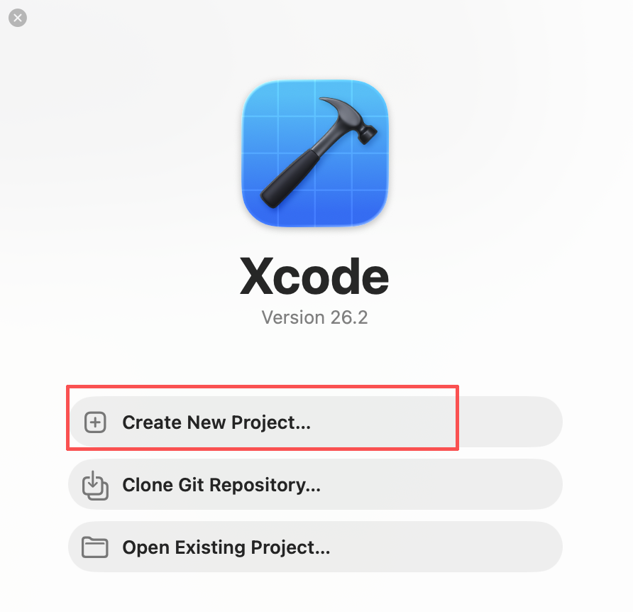

点击 **Create new project** ，进入项目模板选择界面。

### 3.2 选择应用模板与技术栈

在模板选择界面中，按照以下配置选择：

1. Platform：iOS
2. Application 类型：App


点击 **Next** ，进入项目信息配置。

### 3.3 配置项目信息

在项目信息界面中，填写项目的基础配置即可：

1. Product Name：应用名称（例如 FridgeChef）
2. Team：选择你的个人 Apple ID
3. Organization Identifier：反向域名形式（例如 com.example）
4. Bundle Identifier：自动生成，保持默认即可
5. Testing System：Swift Testing with XCTest UI Tests
6. Storage：选择 Core Data（用于后续保存历史数据）
7. 其他选项保持默认

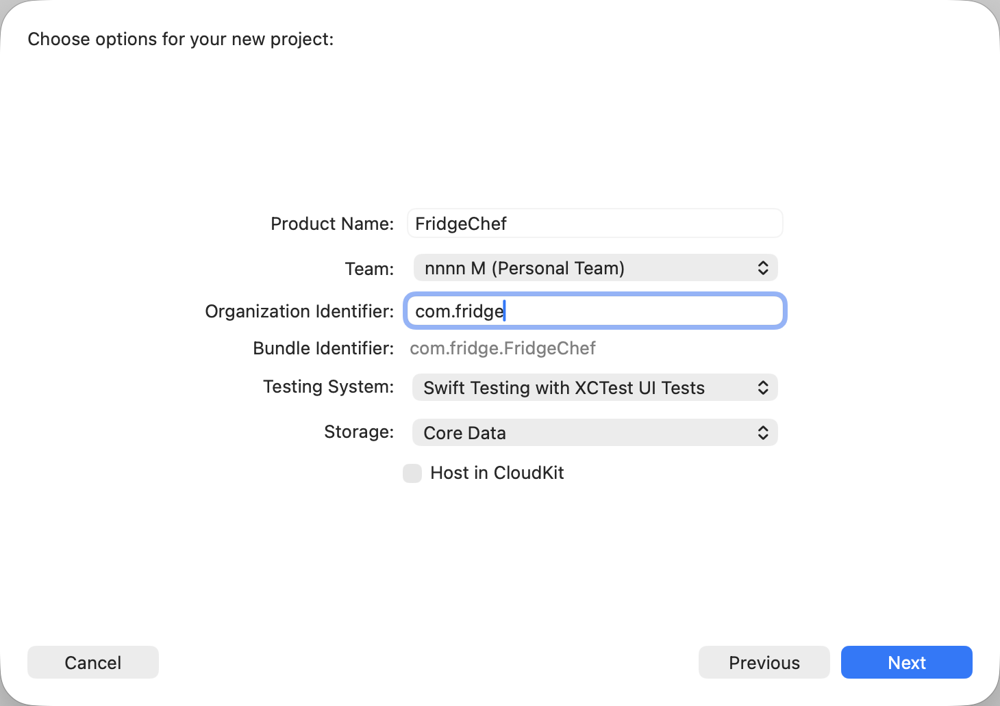

点击 **Next** ，选择项目存放位置。

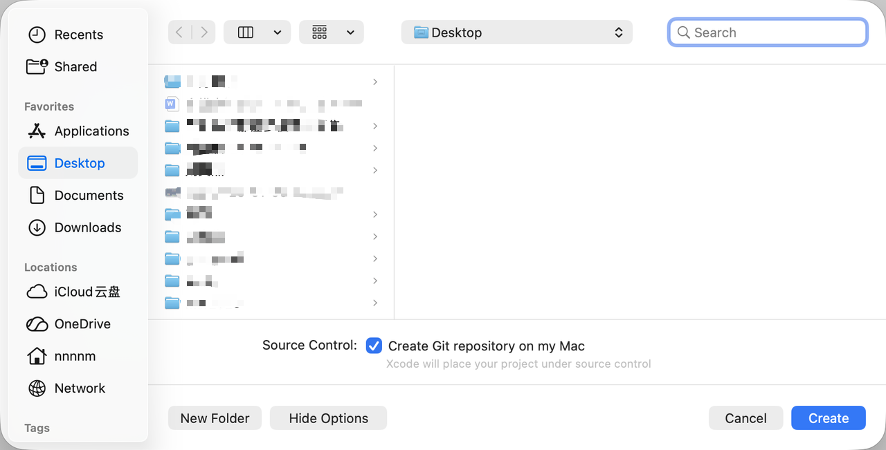

### 3.4 项目创建完成后的结构认识

项目创建完成后，Xcode 会自动打开工程。此时不需要理解所有文件，只需要认识几个关键点。


在默认工程中，你会看到：

- 一个以项目名命名的文件夹
- 一个 `App` 结尾的 Swift 文件（应用入口）
- 一个 `ContentView.swift` 文件（默认页面）

这就是一个最小可运行的 iOS App。

### 3.5 运行第一个 iOS App

在修改任何代码之前，先直接运行这个原始项目。

在 Xcode 顶部工具栏中，保持默认的 iPhone 模拟器选项，点击左上角的 ▶︎ **Run** 按钮。


如果一切正常，模拟器中会显示一个可以正常启动的空白 App。首次编译时间可能较长，后续章节中我们会通过 HTML 原型的方式减少编译等待。

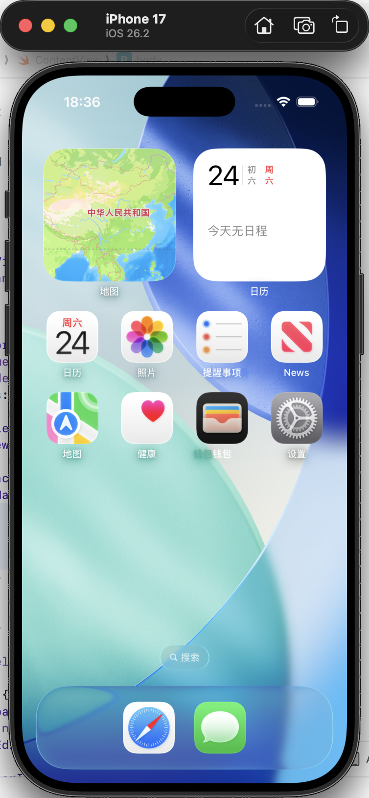

如需停止运行，点击 ▶︎ 按钮旁边的 **Stop** 即可。

### 3.6 这一阶段你真正完成了什么

虽然界面还很简单，但这一阶段已经完成了几件关键确认：

1. 项目可以成功编译
2. 模拟器可以正常运行 App
3. 开发流程已经跑通

这意味着，后续遇到的问题将集中在 **代码和逻辑本身** ，而不再是环境问题。

### 3.7 将项目交给 Trae 管理

从下一节开始，开发的主要工作将逐步转移到 Trae 中完成。

你需要做的只是：**用 Trae 打开刚刚创建的 iOS 项目文件夹。**

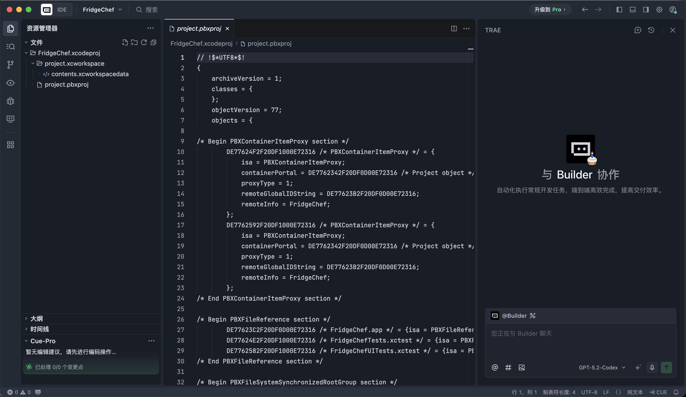

## 第 4 章：AI 辅助开发实战 —— 从零打造「冰箱大厨（FridgeChef）」

这一章是整个教程的核心部分。

本教程不会采用传统的「先写 SwiftUI、反复编译、不断调整预览」的方式，而是使用一套更高效的流程：
**先用 \*\***HTML\***\* 快速验证界面结构，再将结果迁移到 SwiftUI，最后逐步补齐业务逻辑、本地数据和体验细节。**

### 4.1 第一阶段：需求梳理

在开始写代码之前，第一步不是搭页面，而是明确要做什么。**先让 AI 像\*\***产品经理\***\*一样，把需求整理成一份结构清晰的说明文档。**

在 Trae 的对话窗口中输入下面这段指令。Trae 会在项目根目录中生成一份 `REQUIREMENTS.md` 文件，用于描述整个 App 的功能和结构。

📋 **复制** **指令** **（Prompt）** ：

```
我们现在要开发一个名为「冰箱大厨（FridgeChef）」的 iOS App。

1. 核心理念
这是一个解决“冰箱剩菜不知道怎么做”的 AI 助手。
用户输入冰箱里剩余的食材，App 调用大模型生成可执行的食谱。

2. 核心功能
- 首页（Home）：
  显示一个明显的「开始烹饪」入口，下方以卡片或列表形式展示历史生成过的食谱记录。
- 输入页（Input）：
  用户输入食材，支持文本输入或简单的快捷标签。
- 结果页（Result）：
  展示 AI 生成的食谱，包括菜名、食材列表和制作步骤。

3. 技术要求
- 使用 SwiftUI
- 数据保存在本地（Core Data）
- 支持基础的页面跳转与状态更新

请你以产品经理的视角，帮我整理一份清晰、结构化的 REQUIREMENTS.md 文档，并保存在项目根目录。
```

生成完成后，简单浏览一遍文档，确认功能点是否符合你的预期即可。

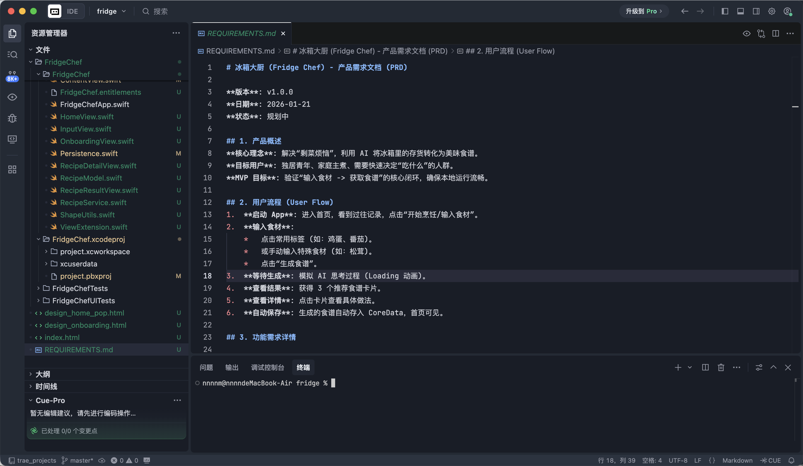

### 4.2 第二阶段：视觉原型

让 AI 用 **HTML\*\*** + \***\*CSS** 快速画出一份高保真界面原型，用于确认整体布局和风格。继续在 Trae 中输入指令：

📋 **复制** **指令** **（Prompt）** ：

```
需求已经确认。
请使用 HTML + Tailwind CSS，为我生成一个高保真的界面原型。

设计风格：Neo-Pop（新波普风格）
配色：
- 背景：淡奶油色 #FFFDF5
- 强调色：酸性绿 #CCFF00、热粉色

视觉特征：
- 3px 粗黑色描边
- 不带模糊的硬阴影（偏移 4px）
- 大圆角卡片，整体偏贴纸 / 漫画感

布局要求：
- 首页使用类似 Bento Grid 的布局
- 包含首页和输入页两个界面

请生成一个单文件 index.html，并模拟 iPhone 屏幕比例包裹内容。
```

生成完成后，在文件列表中找到 `index.html`，直接在浏览器中打开。


此时的重点不是细节是否完美，而是判断：**页面结构是否合理、主要元素是否齐全、整体方向是否正确。**

### 4.3 第三阶段：原生复刻

当 HTML 原型已经定稿后，**把已经确认的界面翻译成 SwiftUI。**

操作步骤如下：

1. 将 `index.html` 文件（或浏览器截图）上传到 Trae
2. 告诉 AI 参考该文件，生成 SwiftUI 代码

📋 **复制指令（Prompt）** ：

```
【已上传 index.html】

请阅读这个 HTML 文件的布局和样式。

任务：使用 SwiftUI 在当前项目中复刻这个界面。

要求：
1. 封装一个 NeoPopStyle 修饰符，包含背景色、粗描边和硬阴影
2. 创建 HomeView.swift，对应首页布局
3. 创建 InputView.swift，对应输入页面
4. 目前使用 Mock Data 填充内容，确保在 Xcode 预览和模拟器中可以正常显示
```

完成后，打开 Xcode 运行模拟器，你会看到一个已经具备完整视觉结构的原生 App。


### 4.4 第四阶段：接入 AI API

界面完成后，App 仍然只是一个展示层。接下来需要接入真实的 AI 能力，本教程使用的是 **SiliconFlow（硅基流动）** 提供的大模型服务：
[https://cloud.siliconflow.cn](https://cloud.siliconflow.cn/)

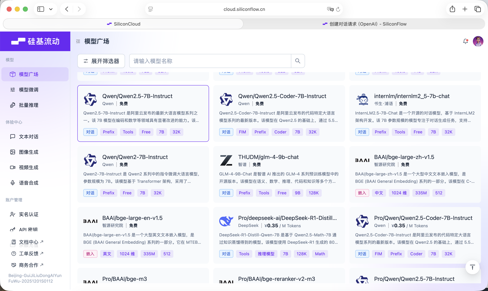

SiliconFlow 提供了兼容 OpenAI API 规范的接口，可以非常方便地在 iOS 项目中通过标准网络请求进行调用。

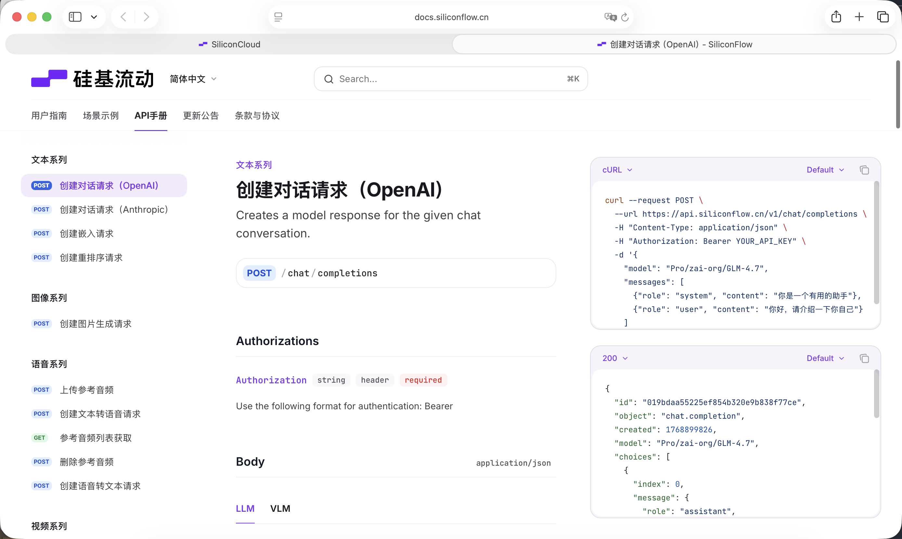

在开始之前，你需要在官网注册账号并创建一个 API Key。


该 Key 将用于后续的模型调用。

📋 **复制指令（Prompt）** ：

```
现在我们要接入 AI 能力。

请创建 APIService.swift。

配置：
- Base URL: https://api.siliconflow.cn/v1
- Model: Qwen/Qwen2.5-7B-Instruct
- API Key：定义为变量，稍后由我填写

功能：
- 编写 generateRecipe(ingredients: [String]) 方法
- System Prompt 严格要求模型只返回纯 JSON
- JSON 字段包括：dishName, ingredients, steps

请同时定义 RecipeModel 结构体，用于解析返回数据。
```

生成代码后，在 `APIService.swift` 中填入你自己的 Key。

### 4.5 第五阶段：Core Data 本地存储

为了让 App 能记住生成过的食谱，需要引入本地数据存储。这一阶段分为两步。

**第一步：手动配置 Core Data（在 Xcode 中完成）**

1. 打开 `FridgeChef.xcdatamodeld`
2. 新建 Entity，命名为 `RecipeEntity`

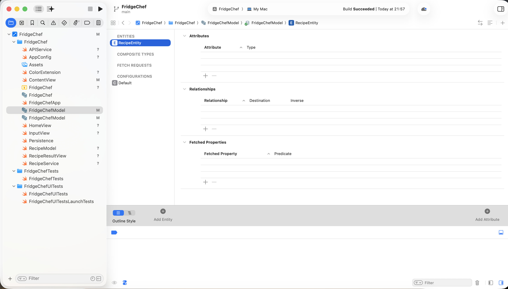

3. 添加属性：
   1. `id`: **UUID**
   2. `name`: **String**
   3. `cookTime`: **String**
   4. `difficulty`: **String**
   5. `desc`: **String**
   6. `timestamp`: **Date**
   7. `colorIndex`: **Integer 16**
      

**第二步：让 AI 编写逻辑代码**

📋 **复制指令（Prompt）** ：

```
我已经完成了 Core Data 的 Entity 配置。

Entity：RecipeEntity
属性：id, name, difficulty, timestamp,colorindex,cookTime,desc

请完成以下任务：
1. 在生成食谱成功后，将数据保存到 Core Data
2. 首页使用 FetchRequest 读取历史记录并按时间倒序展示
3. 当数据库为空时，显示一个友好的空状态提示
```

### 4.6 第六阶段：生成 App 图标

最后一步，是为 App 准备一个正式的图标。这里使用 **Lovart** 生成图标素材：[https://www.lovart.ai/zh](https://www.lovart.ai/zh)


📋 **复制到 Lovart 的 Prompt** ：

```
Subject: A cute anthropomorphic fridge character with a happy face
Style: Minimalistic App Icon, Neo-pop style, thick black outlines, vector art
Colors: Acid green (#CCFF00) and deep blue
Background: Solid cream color
Negative Prompt: Text, realistic details, 3D render, complex background
```

生成后，将图片裁剪为 1024×1024，拖入 Xcode 的 `Assets.xcassets` → `AppIcon` 中。

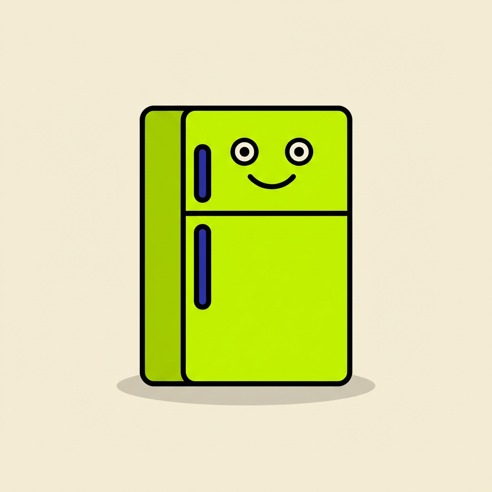

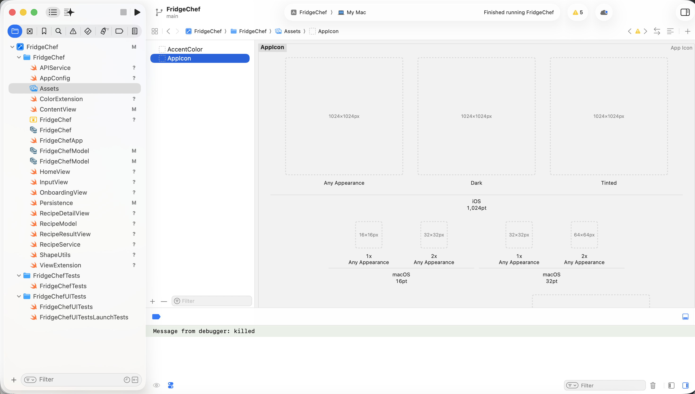

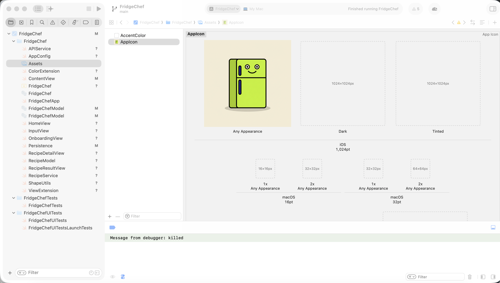

重新运行 App，你会看到一个完整、可识别的真实 iOS 应用。

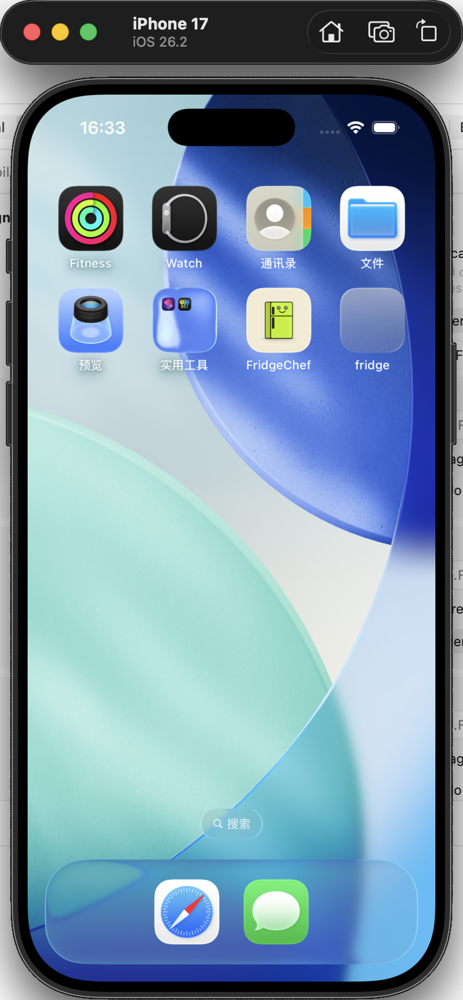

### 4.7 第七阶段：体验进阶

在功能已经稳定的前提下，如果你希望进一步优化视觉风格，只需要向 AI 描述你想要的效果，让它生成新的界面方案，并将确认后的结果移植到 SwiftUI 即可。

📋 参考 Prompt：

```
目前 App 的功能已经完成，但我想尝试一种更有视觉冲击力的 UI 风格。
请先使用 HTML + Tailwind CSS 为我生成一个新的设计稿，文件名为 design_v2.html。
设计风格：Neo-Pop（新波普 / 多巴胺风格）
配色要求：
全屏背景使用 Deep Royal Blue（深皇室蓝）
强调色使用 Acid Green（酸性绿 #CCFF00）
视觉质感：
所有卡片使用 3px 黑色粗描边
使用不带模糊的硬阴影（向右下偏移）
布局要求：
首页结构保持不变
按钮和输入框使用胶囊形状
请生成完整代码，并方便我在浏览器中预览效果。
```

生成完成后，在浏览器中打开这个 HTML 文件。


当 HTML 版本已经定稿，就可以开始修改 iOS 项目。

📋 参考 Prompt：

```
【已上传 design_v2.html】
请分析这个 HTML 的视觉风格，并将它移植到当前 iOS 项目中。
任务要求：
新建一个 NeoPopStyle.swift 文件
封装一个 neoPopBlue() 风格修饰符
修饰符需要包含：
圆角
粗黑描边
不透明硬阴影
重构 HomeView：
背景改为 Deep Royal Blue
主按钮使用 Acid Green
历史记录卡片使用白色背景
确保文字颜色在深色背景下依然清晰可读
请给出完整修改代码。
```

重新点击 Xcode 的 Run 按钮。如果一切正常，你会看到：

- 功能与之前完全一致
- 视觉风格发生了明显变化
- 应用整体质感显著提升


## 第 5 章：运行、调试与错误处理

在上一章中，你已经完成了功能开发，并成功在模拟器中运行了 App。
但对一个 iOS 应用来说，真正的完成并不只是“能编译通过”，而是 **能够稳定运行，并在出现问题时知道如何处理** 。

### 5.1 在 Xcode 中运行 App

首先，确保项目可以在 Xcode 中正常运行。

在 Xcode 左上角选择运行设备，保持默认的 iPhone 模拟器即可，点击 ▶︎ Run 按钮进行编译和运行。如果一切正常，App 会在模拟器中启动，并显示第四章中完成的界面。

### 5.2 在真机上运行 App

将 iPhone 通过数据线连接到 Mac。


首次连接时，手机会弹出「是否信任此电脑」，选择信任并输入解锁密码。

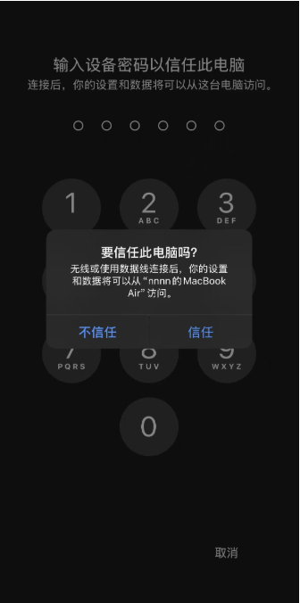

在 Xcode 的设备列表中，选择你的 iPhone，然后再次点击 ▶️ Run。

此时，你应该可以在手机桌面看到「冰箱大厨」的图标，并且可以正常打开和使用。


这一步，标志着一次完整的 iOS 开发闭环已经完成。

### 5.3 iOS 开发中错误从哪里来

在实际开发过程中， **遇到错误是常态** ，而不是例外。

常见问题通常来自以下几类：

1. **编译错误**
   Swift 语法、类型不匹配、缺少参数等问题，Xcode 会直接报红。
2. **运行时错误**
   应用可以编译，但在运行时崩溃，例如数组越界、空值解包。
3. **权限或配置错误**
   网络请求被系统拦截、Info.plist 未配置、签名问题等。
4. **逻辑错误**
   程序不崩，但行为不符合预期，例如按钮无响应、数据未刷新。

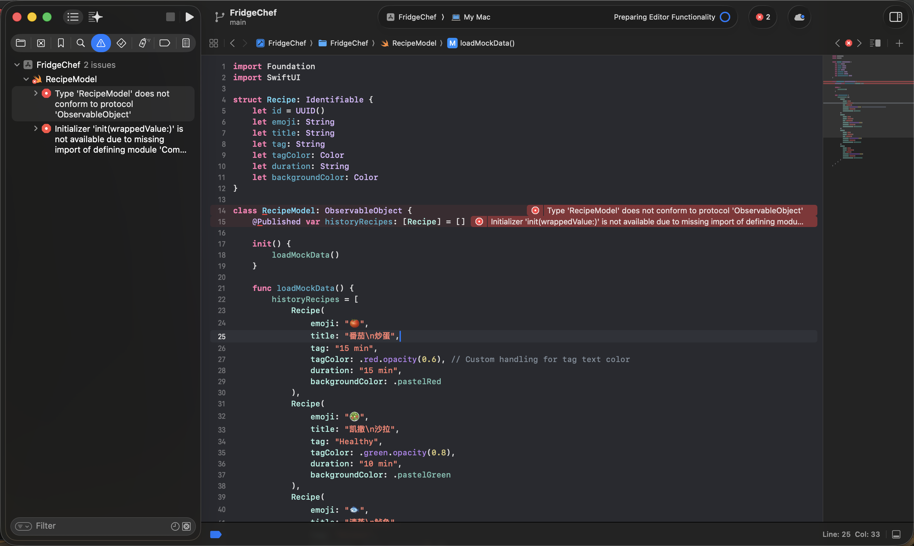

当出现任何错误，只需 **把完整的报错信息，原样复制进 Trae 的对话框。** Trae 会在理解项目上下文的前提下，帮你完成Debug工作。

### 5.4 真机调试时常见报错解决方法

在真机调试阶段出现报错是非常常见的情况。这些问题通常并不是代码错误，而是与设备、安全策略或签名配置有关。如果 App 无法顺利运行在 iPhone 上，可以优先对照本节进行排查。

#### 一、签名与注册相关问题

**常见现象：**

- Xcode 报红，提示
  `"Communication with Apple failed"`
  或
  `"No profiles for 'com.xxx.xxx' were found"`
- 提示
  `"Your team has no devices which are compatible"`

**原因说明：**

- Bundle Identifier 不唯一或无效
- 当前 iPhone 尚未注册到你的 Apple ID 用于开发调试

**解决方法：**

1. **修改 Bundle Identifier**
   在 Xcode 项目设置中，将 Bundle Identifier 改为更独一无二的值，例如：
   `com.yourname.FridgeChef`
2. **让 Xcode 自动注册设备**
   在报错提示中点击 `Try Again` 或 `Register Device`，由 Xcode 自动完成设备注册和证书配置。

#### 二、设备配对与连接问题

**常见现象：**

- Xcode 顶部显示
  `"Device is not available because pairing is in progress"`
- 提示
  `"Device Locked"`
- 已点击“信任”，但 Xcode 仍然卡住

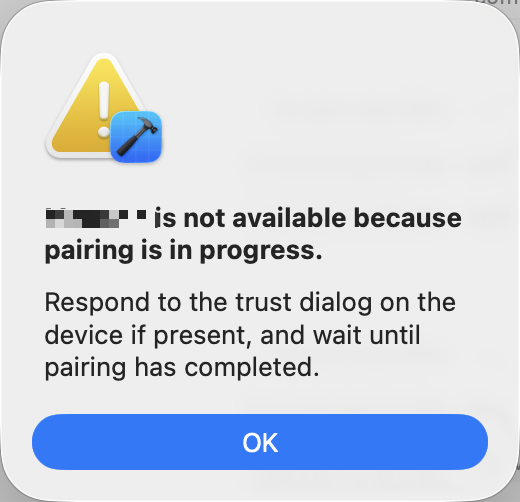

**原因说明：**

- iPhone 处于锁屏状态
- 配对流程未完全完成
- Xcode 连接状态未刷新

**解决方法：**

1. 解锁手机
   确保 iPhone 已解锁并停留在桌面界面。
2. 完成信任流程
   当手机弹出“是否信任此电脑”时，点击 **信任** ，并**输入锁屏密码。**
3. 刷新连接状态
   如仍卡住，可拔掉数据线等待 2–3 秒重新插入；必要时重启 Xcode 再试。

#### 三、安装后无法打开 App

**常见现象：**

- App 已成功安装到 iPhone 桌面
- 系统提示
  “不受信任的开发者（Untrusted Developer）”


**原因说明：**

这是 iOS 的安全机制。通过个人 Apple ID 安装的调试 App 需要手动授权。

**解决方法：**

1. 打开 iPhone「设置」
2. 进入「通用」
3. 点击「VPN 与设备管理」
4. 在“开发者 App”中找到你的 Apple ID
5. 点击 **信任** ，并再次确认


完成后，回到桌面重新点击 App，即可正常运行。

## 第 6 章：如果想把 App 上架到 App Store

在本教程中，我们主要完成的是 **个人开发调试版 App 的完整闭环** ：从创建项目、开发功能、运行调试，到最终可以在真机上成功安装和使用。

如果你希望进一步将 App 正式发布到 **Apple App Store** ，让所有用户都能下载使用，则需要进入一套更正式的发布流程。由于该流程涉及付费账号、审核规范与合规要求，且并非本教程的实践重点，下面内容仅作为 **整体参考与路径指引** 。


> 以下内容参考了 Apple 官方审核要求以及公开讨论（包括知乎原创经验分享）。链接见附录。※如果链接失效，可搜索相关标题或关键词查阅原始内容。

### 6.1 Apple Developer Program

要将 App 发布到 App Store，必须加入 Apple 的付费开发者计划：

- **Apple Developer Program** （每年 $99 美元）
- 官方网址：[https://developer.apple.com/](https://developer.apple.com/)

加入后，你才能使用 **App Store Connect** ，进行 App 创建、版本管理和正式发布。

### 6.2 App Store Connect：创建 App 条目

在 App Store Connect 中，你需要为 App 创建一个完整的条目，包括但不限于：

1. App 名称与 Bundle ID
2. 描述、关键词、隐私政策链接
3. App 图标、截图与预览素材
4. 定价与分发地区设置

这些信息必须填写完整，否则无法提交审核。

### 6.3 构建与提交审查

完成信息配置后，需要：

1. 使用付费账号在 Xcode 中进行 Release 签名
2. 构建并上传正式版本
3. 在 App Store Connect 中提交审核

App 提交后会进入 Apple 的审核队列，审核时间通常为 1–3 天，具体视情况而定。

### 6.4 审核规范与常见原因

Apple 会从以下几个方面审核 App：

- 功能与稳定性
- 隐私与数据合规
- 元数据与实际功能一致性
- 是否涉及侵权或误导行为

如果不符合要求，审核会被拒绝，并给出具体原因，开发者需要根据反馈进行修改后重新提交。

### 6.5 审核拒绝后的处理与沟通

当审核被拒时，你可以：

- 根据反馈修改代码或描述
- 重新提交版本
- 通过 App Store Connect 向审核团队进行说明和沟通

这是 App 上架过程中非常常见的一步，并不代表项目失败。

### 参考资料与引用来源

以下内容参考了 Apple 官方文档及公开经验分享：

- App Store Review Guidelines（Apple 官方）
  [https://developer.apple.com/app-store/review/guidelines/](https://developer.apple.com/app-store/review/guidelines/?utm_source=chatgpt.com)
- App 提交审核官方说明
  [https://developer.apple.com/cn/help/app-store-connect/manage-submissions-to-app-review/submit-for-review](https://developer.apple.com/cn/help/app-store-connect/manage-submissions-to-app-review/submit-for-review?utm_source=chatgpt.com)
- 图文详解｜iOS App 上架全流程及审核避坑指南（知乎）
  [https://zhuanlan.zhihu.com/p/146128612](https://zhuanlan.zhihu.com/p/146128612)

## 第7章：总结


Congrats! 到这里你已经把完整的i0S App开发流程从0到1亲手走了一遍。从把环境搭好、跑起项目，再到界面、功能、数据、真机运行一步步落地，中间步骤都顺利完成了，很棒哦! 更重要的是，你不是通过死背Swift语法走到这一步，而是把一切交给AI~ 不管你是什么专业，每一次的尝试都只会让你更快更顺，你发现i0S开发也不是那么困难，哪怕一行代码都不会写，也能实现自己的应用。

回头看，整个流程其实并不复杂:想清楚要做什么，用HTML快速试界面，转换为SwiftUI代码，接上API和本地数据，最后跑一遍调试就好了。基于此，在未来你还可以随手做一个只给自己用的闹钟、一个极简Todo List，或者用喜欢明星的语气做个对话机器人。

这就是这套教程最核心的地方，也是easy-vibe最想教会你的事情! 期待住各位vibe coding大师们的最新杰作! 期待被你的作品美晕的一天!
