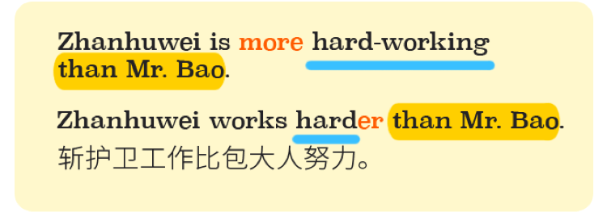
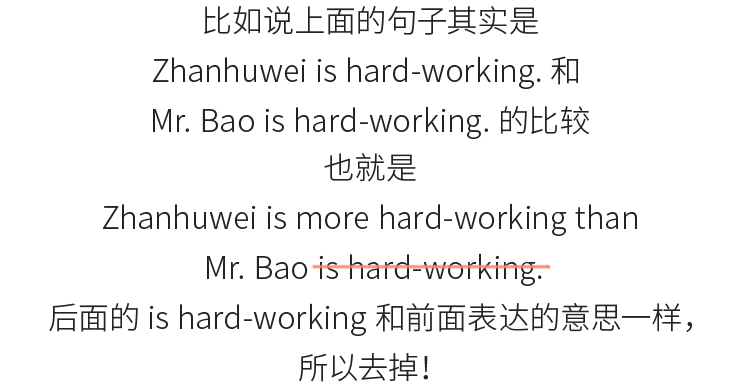
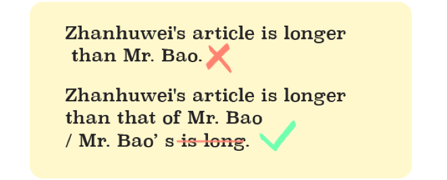
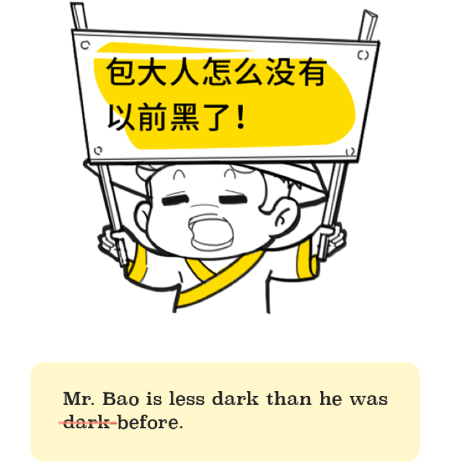
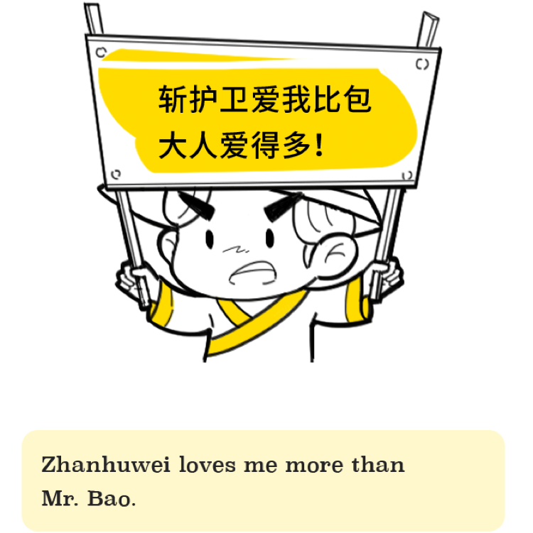
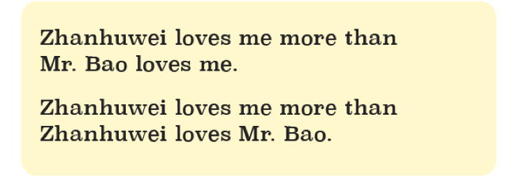

# 搞事的比较级

最近很多人都喜欢上了比较，那我们这一次就用英语来搞事情！

1. 造一个含有形容词的或者副词的句子。

2. 再将句中形容词和副词变成比较级。

3. 再加上比较的对象，想怼谁加谁。

比较时，要遵循**去同存异**原则。

简单的搞事都好处理。
按照去同存异的原则，
我们现在去看看
那些想搞个大新闻的同学。
我们搞事的时候就可以看准对象啦！

**搞错对象，可是要负责的！**
**从属关系间的比较**

这里比较的是斩护卫的文章，所以，大家不能说，

这里的 that 指代 article ，
所以是包大人的文章和斩护卫比。
自己和自己比较

跟自己比的时候，
时间不一样，
动词 was 不能省掉哟。

**句子之间的比较**

一看觉得没毛病，
但是有两层意思。

到底是斩护卫爱你
比包大人爱你多，
还是，
斩护卫爱包大人比爱你多呢。
为了区分意思，所以我们只能说，

不过有些词是自带搞事光环，
perfect，superb，excellent，sublime 
这些含义里带有“最”“极其”的单词，
不能有比较级和最高级，
不然真的要上天！

好了，记住搞事三步曲和去同存异法则，
学会用英文搞事了么？

我们的口号是！

