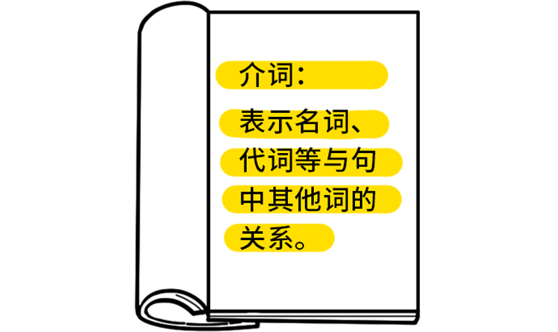
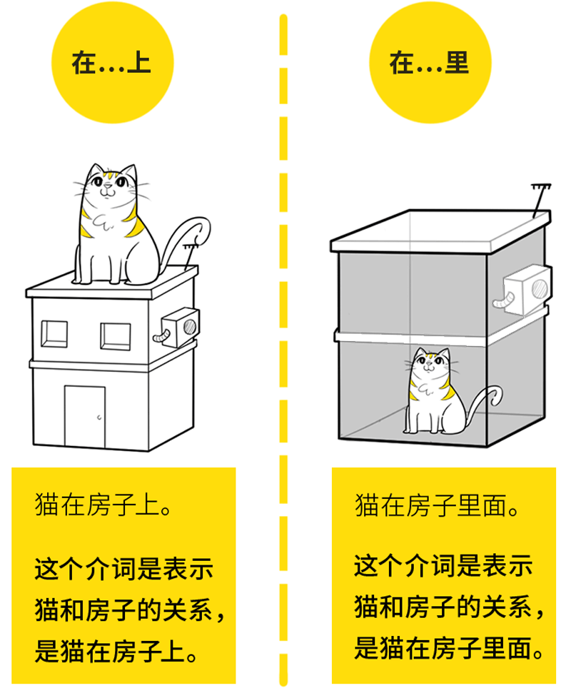
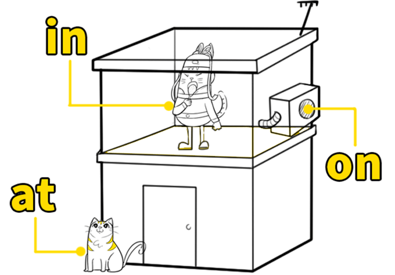
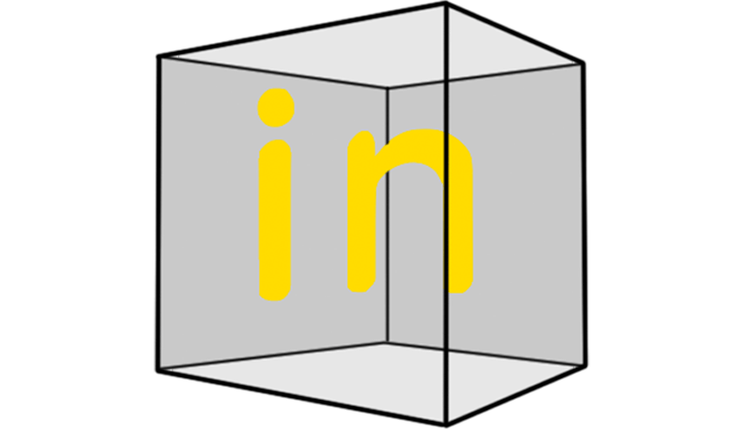
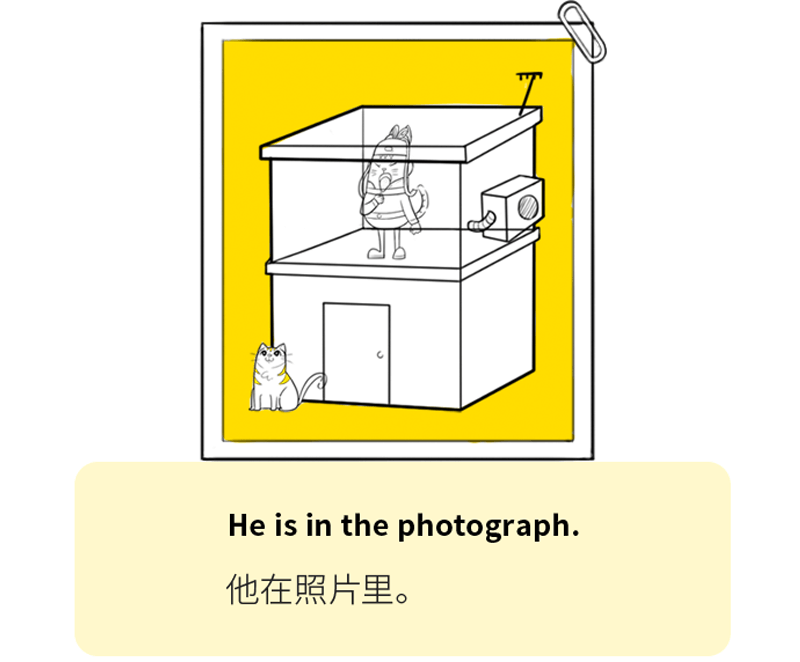
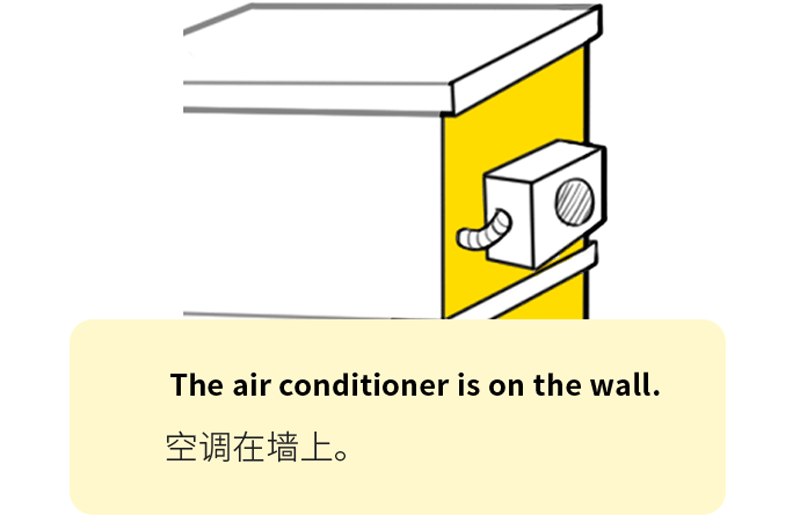
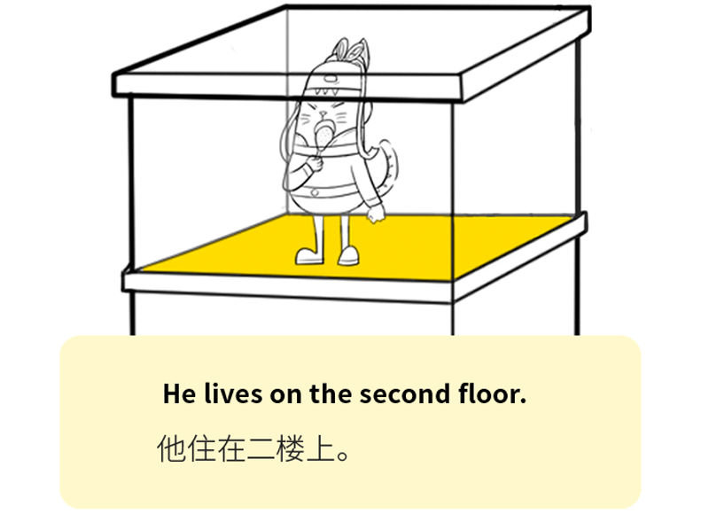
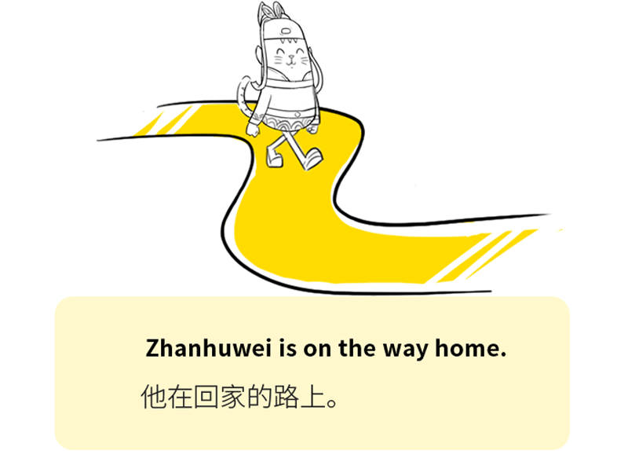
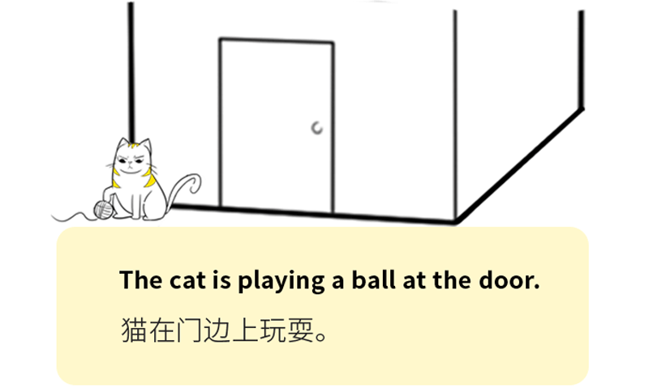
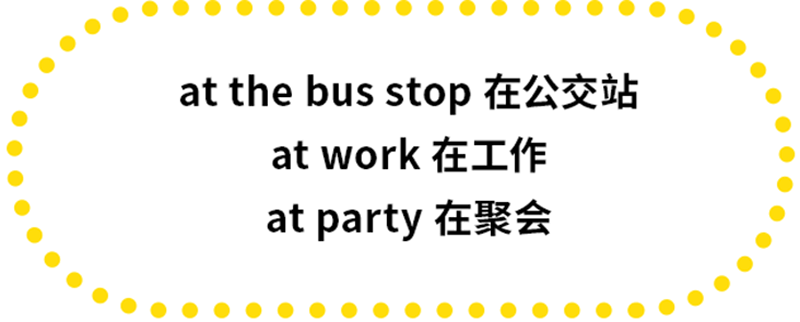

# 如何用介词in/on/at表示位置

要搞明白介词，我们就先知道介词是什么？

看起来十分的抽象，我们可以用中文举个例子。

回想一下，
我们在学习中文的时候，
可没有死记硬背什么 介词 固定搭配，
在房子上或者在房子里。

为什么呢？
大家都知道，
因为我们理解了中文的内在含义。

那怎么理解这些英文介词的内在含义呢？

今天先讲表示位置的in/on/at。

in表示在里面，
强调在其的内部。

(斩护卫对于房间，他是在房间的里面。)

(鸡腿对于嘴，鸡腿在嘴的里面。)

(
虽然照片是平面，但是人是和照片融为一体的。
)

in是强调事物被包含在内部。

on表示在上面，
强调在平面上。

(
floor有地板的意思，住在第二层地板上。
)

(
在路面上走。
)

on强调事物在其表面上。

at把位置当作一个“点”

(斩护卫是大学里面的一员。)

at强调把事物看成一个点。

今天的内容，
看似简单，
但需要大家静下心来好好理解喔！