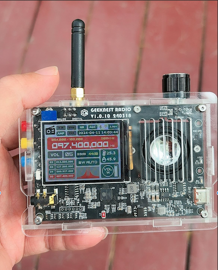
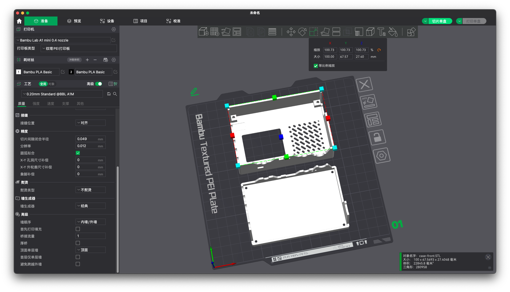
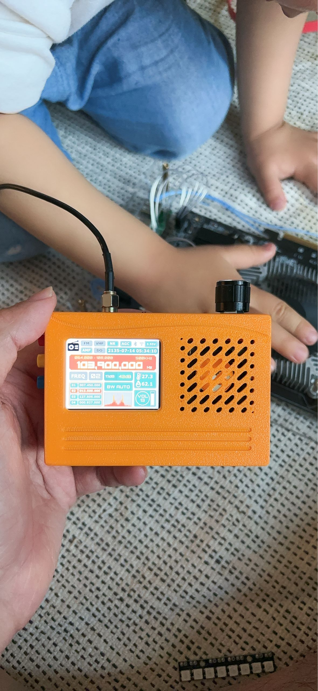
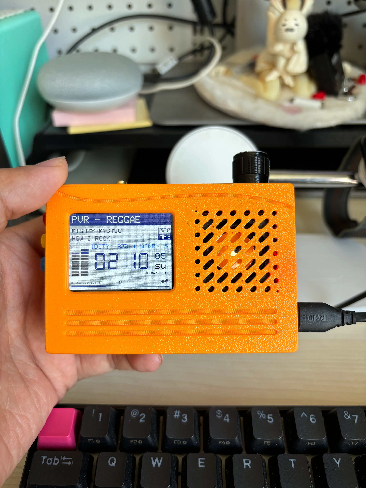

# GeekNest Radio 极客巢全波段收音机（咕咕机）

<iframe src="//player.bilibili.com/player.html?aid=1052882540&bvid=BV1cH4y1M787&cid=1522976612&p=1" scrolling="no" border="0" frameborder="no" framespacing="0" allowfullscreen="true" width="100%" height="350px"></iframe>

### 频率范围：

+ 520KHz ~ 1710KHz / AM-MW 调幅中波
+ 3.5MHz ~ 30MHz
  + AM-SW 调幅短波
  + SSB 单边带
  + LSB 下边带
  + USB 上边带
+ 64MHz ~ 108.5MHz / FM 调频
+ 118MHz ~ 137MHz / 航空波段
+ *据说后面会开源 UHF 的接收和发射模块*

### 使用说明

设备顶部左侧 SMA 接口可以使用 50欧姆阻抗天线，可以使用拉杆天线，[甜甜圈天线 by 会飞的鱼](../hfdy) 需要使用 Hi-Z 阻抗转换器。

设备顶部右侧是编码器旋钮，按下可以切换模式：

1. MENU：菜单
2. VOL：音量调节
3. CHAN: 频道模式 (240412 版本新增)
4. FREQ：频率调节
5. SEEK：频道搜索

除此之外，顶部还有 *Analog/Digital 模式切换开关* 和 *磁棒天线开关*。

设备左侧有三个按键分别是：

1. A: select
2. B: up
3. C: down

#### 菜单模式

按下编码器旋钮开关切换到 *MENU* 模式：

+ 选中频道切换，按 *up* / *down* 可以切换频段：
  1. AM-MW
  2. AM-SW
  3. AIR (VHF) 
  4. FM (VHF)
  5. LSB-SW (AO only)
  5. LSB-MW (AO only)
  5. USB-SW (AO only)
  5. USB-MW (AO only)
+ 选中 *NR* 按 *up* / *down* 可以切换 NR（Noise Reduce）降噪开关。
+ 选中 *AGC* 按 *up* / *down* 可以切换 AGC（Automatic Gain Control）自动增益控制开关。
+ 选中 *AMP* 按 *up* / *down* 可以切换 AMP（Amplifier）增益器开关。
+ 选中 *AO/DO* 按 *up* / *down* 可以切换 AO/DO（Analog/Digital Output）数字输出开关。

#### 频道模式

***(240412 版本新增)***

在频道模式可以通过编码器旋钮调整频道

#### 频率模式

在频率模式可以通过编码器旋钮自由调整频率

按 *select* 可以切换步进频率大小

#### 搜索模式

在频道搜索模式可以通过编码器旋钮向前或向后根据信噪比搜索频道

TODO: 存储频道

#### 音量模式

在音量模式可以通过编码器旋钮调节音量

在音量模式下按 *up* / *down* 可以切换已存储的频道

#### 屏幕设置

+ 同时按下 *select* + *down* 可以切换*主题配色*和*屏幕方向*旋转。
+ 同时按下 *select* + *down* 旋转编码器可以调整屏幕亮度。

## 外壳

***3D 打印外壳文件来自群友 @Sandy 提供。***

+ [外壳 - 前](./case-front.STL)
+ [外壳 - 后](./case-back.STL)

FDM 需要将模型放大 1mm（宽 99mm -> 100mm），然后打印

<blockquote class="twitter-tweet" data-media-max-width="560">
<a href="https://t.co/eeSw8gkJfp">pic.twitter.com/eeSw8gkJfp</a>
&mdash; Lsong  (@lsongdev) <a href="https://twitter.com/lsongdev/status/1778771674772668494?ref_src=twsrc%5Etfw">April 12, 2024</a></blockquote> 

然后将自带的铜柱使用电烙铁热熔进外壳的螺丝孔中固定, 完成效果如下：

## 固件升级

固件可以从群文件中获取，目前提供*无线电收音机固件*和*网络收音机固件*。

可以使用 esptool.py 或者 WebESP <https://lsong.org/webesp> 浏览器 写入固件。

可以参考 [ESP32刷写固件](../espx) 方面的说明

选择固件 [FW_0.2.9.8_for_V5A_240412.bin](FW_0.2.9.8_for_V5A_240412.bin)，起始地址为：`0x00000000`，点 Flash 即可。

*有部分群友使用 Windows 刷机软件有遇到写入后设备自检错误的情况，可以按 RST 重置或者重新拔插电池，我使用 WebESP 没有遇到此问题。*

---

## WebRadio 固件

刷入固件初次使用会显示配网界面，配置完成后会自动进入 WebRadio 界面

旋转编码器旋钮可以调整音量

按「1」进入或按下编码器按钮可以进入 *频道选择*，旋转编码器可以调整频道，按下编码器按钮可以进行「确认」操作。

按「2」显示当前城市的天气预报

关机状态下，按住 2+3 按钮然后开机可以再次进入配网界面。

---

## ёRadio 开源固件

源代码由 [巢主Sama#]() & [BD3OYD](https://radioid.net/database/view?callsign=BD3OYD) 贡献， 我 [BI1GDD](https://radioid.net/database/view?callsign=BI1GDD) 做了少量改动托管在 <https://github.com/song940/yoradio/tree/geek-nest-radio>

从 [releases](https://github.com/song940/yoradio/releases) 下载固件，然后通过 [WebESP](https://lsong.org/webesp) 刷入固件。

启动后会进入 AP 模式，SSID 是 `yoRadioAP` 密码是 `12345987` 连接后打开 192.168.4.1 进入配置页面，

在页面中配置 Wi-Fi 信息，然后上传 `yoRadio/data/www` 所有文件，然后通过连接后的 IP 地址打开就有 WebRadio 的播放界面了。

点击页面左上角的 「🎵播放列表」 图标，进入播放列表界面，点击 「IMPORT」导入 [data/playlist.csv](https://github.com/song940/yoradio/blob/geek-nest-radio/yoRadio/data/data/playlist.csv) 播放列表就可以播放电台了。

---