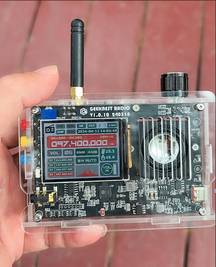
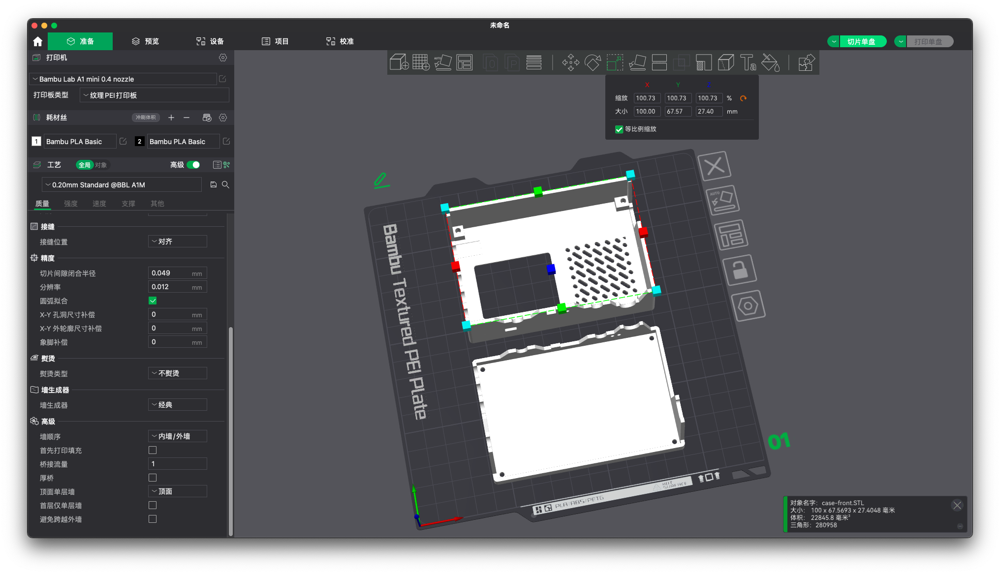
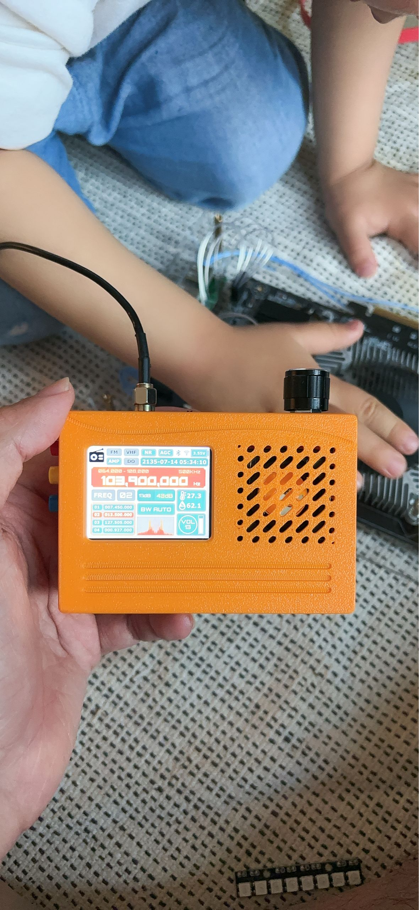
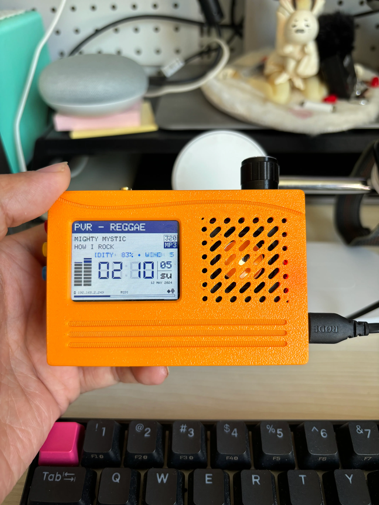

# GeekNest Radio 极客巢全波段收音机（咕咕机）



<iframe src="//player.bilibili.com/player.html?aid=1052882540&bvid=BV1cH4y1M787&cid=1522976612&p=1" scrolling="no" border="0" frameborder="no" framespacing="0" allowfullscreen="true" width="100%" height="350px"></iframe>

### 频率范围：

+ 520KHz ~ 1710KHz / AM-MW 调幅中波
+ 3.5MHz ~ 30MHz
  + AM-SW 调幅短波
  + SSB 单边带
  + LSB 下边带
  + USB 上边带
+ 64MHz ~ 108.5MHz / FM 调频
+ 118MHz ~ 137MHz / 航空波段
+ *据说后面会开源 UHF 的接收和发射模块*

### 使用说明

设备顶部左侧 SMA 接口可以使用 50欧姆阻抗天线，可以使用拉杆天线，甜甜圈天线 by 会飞的鱼需要使用 Hi-Z 阻抗转换器。

设备顶部右侧是编码器旋钮，按下可以切换模式：

1. MENU：菜单
2. VOL：音量调节
3. CHAN: 频道模式 (240412 版本新增)
4. FREQ：频率调节
5. SEEK：频道搜索

除此之外，顶部还有 *Analog/Digital 模式切换开关* 和 *磁棒天线开关*。

设备左侧有三个按键分别是：

1. A: select
2. B: up
3. C: down

#### 菜单模式

按下编码器旋钮开关切换到 *MENU* 模式：

+ 选中频道切换，按 *up* / *down* 可以切换频段：
  1. AM-MW
  2. AM-SW
  3. AIR (VHF) 
  4. FM (VHF)
  5. LSB-SW (AO only)
  5. LSB-MW (AO only)
  5. USB-SW (AO only)
  5. USB-MW (AO only)
+ 选中 *NR* 按 *up* / *down* 可以切换 NR（Noise Reduce）降噪开关。
+ 选中 *AGC* 按 *up* / *down* 可以切换 AGC（Automatic Gain Control）自动增益控制开关。
+ 选中 *AMP* 按 *up* / *down* 可以切换 AMP（Amplifier）增益器开关。
+ 选中 *AO/DO* 按 *up* / *down* 可以切换 AO/DO（Analog/Digital Output）数字输出开关。

#### 频道模式

***(240412 版本新增)***

在频道模式可以通过编码器旋钮调整频道

#### 频率模式

在频率模式可以通过编码器旋钮自由调整频率

按 *select* 可以切换步进频率大小

#### 搜索模式

在频道搜索模式可以通过编码器旋钮向前或向后根据信噪比搜索频道

TODO: 存储频道

#### 音量模式

在音量模式可以通过编码器旋钮调节音量

在音量模式下按 *up* / *down* 可以切换已存储的频道

#### 屏幕设置

+ 同时按下 *select* + *down* 可以切换*主题配色*和*屏幕方向*旋转。
+ 同时按下 *select* + *down* 旋转编码器可以调整屏幕亮度。

## 硬件

咕咕机 V5A 的硬件工程已经由 [巢主Sama#](https://oshwhub.com/alec_cy/geek-nest-full-band-radio-v5a-op) 公布，主控仍然是 ESP32，搭配外部 Flash 和 PSRAM。

这里整理一下后续写固件可能用到的硬件资源。资料来自作者的硬件说明、[V5A 的 ёRadio 适配代码](https://github.com/aleccy/yoradio) 和 [katsumo 的开发记录](https://note.com/katsumo/n/n974036c34047)，还没有在我这台机器上逐项测量，主板版本不同也可能有差异。

| 模块 | 芯片 / 方案 | 说明 |
| --- | --- | --- |
| 主控 | ESP32 + Flash + PSRAM | 具体型号和容量待确认 |
| 收音 | SI4732 | FM / AM / SSB |
| 航空波段 | Si5351 + SA602 | 本振和混频，扩展接收频率范围 |
| 屏幕 | ST7789 | 原配 2 寸，ёRadio 按 240 × 320 初始化 |
| 数字功放 | MAX98357 | I2S 输入 |
| IO 扩展 | 9555 / XL9555 | 控制收音板的复位、供电和信号路径 |
| RTC | PCF8523T | 作者建议可以改 DS3231，但是不兼容原来的引脚布局 |
| 电源 | 单节锂电 + FP6276B | 升压给混频器和功放供电 |
| UHF 扩展 | AT1846S | 需要另接扩展板 |

航空波段并不是 SI4732 直接接收 118MHz ~ 137MHz，而是经过 Si5351 和 SA602 混频后再接收。katsumo 的实验使用 10.7MHz 中频，本振频率的计算方式还需要核对原理图。

### GPIO

下面的编号都是 **ESP32 GPIO 编号**，不是芯片或连接器的物理脚序，来自 [myoptions.h](https://github.com/aleccy/yoradio/blob/b4b1a00cde7dbc1c55a957a72f501a77c160a358/yoRadio/src/myoptions.h) 和 [main.cpp](https://github.com/aleccy/yoradio/blob/b4b1a00cde7dbc1c55a957a72f501a77c160a358/yoRadio/src/main.cpp)。我自己的 ёRadio 分支使用的屏幕、按键和音频配置也是这些引脚。

| 功能 | 配置项 | GPIO |
| --- | --- | --- |
| 屏幕时钟 | TFT_SCLK | 18 |
| 屏幕数据 | TFT_MOSI | 19 |
| 屏幕片选 | TFT_CS | 22 |
| 屏幕数据 / 命令 | TFT_DC | 23 |
| 背光 | BRIGHTNESS_PIN | 21 |
| I2S 位时钟 | I2S_BCLK | 25 |
| I2S 音频数据输出 | I2S_DOUT | 26 |
| I2S 帧时钟 | I2S_LRC | 27 |
| select 按键 | BTN_CENTER | 35 |
| up 按键 | BTN_UP | 32 |
| down 按键 | BTN_DOWN | 12 |
| 编码器一相 | ENC_BTNL | 38 |
| 编码器另一相 | ENC_BTNR | 37 |
| 编码器按下 | ENC_BTNB | 36 |
| 电池电压 | ADC1_CHANNEL_3 | 39 |
| 电源保持 | OUTPUT / HIGH | 4 |

按键在代码中按低电平触发处理，实际 A / B / C 的对应关系和编码器旋转方向还需要测试。

屏幕采用硬件 SPI，配置为 `DSP_HSPI=true`，驱动默认使用 40MHz 时钟，横屏旋转为 1 或 3。`TFT_RST=-1` 表示代码没有通过 GPIO 控制屏幕复位，并不能据此判断硬件复位脚没有接线。

GPIO35 ~ GPIO39 只能作为输入使用，也不能依赖内部上拉，编码器配置里已经关闭了内部上拉。GPIO12 是启动配置引脚，修改按键电路时需要留意上电状态。可以参考 [ESP32 Datasheet](https://documentation.espressif.com/esp32_datasheet_en.html)。

电池检测使用 ADC1 的 channel 3，也就是 GPIO39，ёRadio 的换算代码约为采样电压的 2 倍，具体分压电阻和校准值还需要测量。

较新的主板还有电源保持电路，ёRadio 在启动时执行：

```cpp
pinMode(4, OUTPUT);
digitalWrite(4, HIGH);
```

[katsumo](https://note.com/katsumo/n/n974036c34047) 提到 v1.0.12 及以后的主板刷写时需要打开电源开关并按住编码器，启动后由 GPIO4 保持供电。写自己的固件时要先确认主板版本，否则可能刚启动就断电。

### 收音板和 I2C

ёRadio 配置中注释掉的 RTC 引脚是 `SDA=13`、`SCL=15`，katsumo 的 V5A 实验也使用这组 I2C 引脚：

| 设备 / 信号 | 地址 / 引脚 | 说明 |
| --- | --- | --- |
| I2C SDA | GPIO13 | 共用总线 |
| I2C SCL | GPIO15 | 共用总线 |
| XL9555 | 0x20 | 7 位 I2C 地址，来自实验代码 |
| SI4732 | 0x11 | 7 位 I2C 地址，来自实验代码 |
| SI4732 RESET | XL9555 P0.0 | 拉低后再拉高复位 |

这里比较特别的是，**SI4732 的复位接在 IO 扩展器上**，不能直接照抄普通 ESP32 + SI4732 开发板的 GPIO 复位代码。

katsumo 的实验还用到了下面几个端口，不过作者也注明了初始化问题，部分信号极性没有确定，暂时只作为查线的线索：

| XL9555 端口 | 实验中的用途 | 实验操作 |
| --- | --- | --- |
| P0.5 | AM 射频路径 | 写低，作者对极性有疑问 |
| P1.2 | SA602 电源 | 写低开启 |
| P1.5 | 放大器 | 写低开启，具体是哪一级放大器待确认 |
| P1.6 | 模拟音频路径 | 写高开启 |

作者的硬件说明中，*AMP* 同时控制 `ANT_IN_SW` 和 `RADIO_LNA_SW`，高为开启，低为关闭。这两个信号的具体端口还没核实，不能直接把它们和上面的 P1.5 对应起来。

TODO: 核对 XL9555 全部端口的用途、输入输出方向和上电默认值。实验代码把两个端口全部设为输出，这部分不能直接拿来作为新固件的初始化。

### 音频输出

咕咕机采用单声道方案，通过双刀双掷物理开关切换两路功放的输出：

+ 数字输出：I2S → MAX98357 → 扬声器
+ 模拟输出：SI4732 模拟音频 → 收音板模拟功放 → 扬声器

作者说明中提到扬声器使用 3Ω / 4W 负载，实物规格和模拟功放型号还需要确认。SSB 不支持这里的数字音频输出，所以单边带模式要走模拟输出。

前面 GPIO25 / 26 / 27 的定义，确认的是 ёRadio 中 **ESP32 向数字功放播放音频** 的方向。SI4732 的数字音频怎样进入 ESP32，输入数据脚、时钟方向和格式还没核实，不能把 `I2S_DOUT` 当成收音芯片的数据输入。

顶部的 Analog / Digital 和磁棒天线开关也可能只是切换硬件线路，是否有 GPIO 能读取开关状态还需要查线。

TODO: SI4732 数字音频接线、模拟功放使能 / 静音、射频路径切换、两个物理开关的状态检测。

## 外壳

***3D 打印外壳文件来自群友 @Sandy 提供。***

+ [外壳 - 前](https://drive.google.com/file/d/1i0ALeSgbCvX1osSV3ONp1mHh_6cz6qKE/view?usp=drive_link)
+ [外壳 - 后](https://drive.google.com/file/d/1wmHFhIokOlLcNKbirj6KLlFqNyfN-DuN/view?usp=drive_link)



由于原设计是为光固化设计的，FDM 打印由于热胀冷缩的原因会有点小，需要将模型放大 1mm（宽 99mm -> 100mm），然后打印

<blockquote class="twitter-tweet" data-media-max-width="560"><p lang="zxx" dir="ltr"><a href="https://t.co/eeSw8gkJfp">pic.twitter.com/eeSw8gkJfp</a></p>&mdash; Lsong  (@lsongdev) <a href="https://twitter.com/lsongdev/status/1778771674772668494?ref_src=twsrc%5Etfw">April 12, 2024</a></blockquote> <script async src="https://platform.twitter.com/widgets.js" charset="utf-8"></script>

然后将自带的铜柱使用电烙铁热熔进外壳的螺丝孔中固定, 完成效果如下：



这里提供一份来自 [DD6CN](https://radioid.net/database/view?callsign=DD6CN) 修改的外壳 [V5A_Front_new_Hardware_1_0_12.stl](https://drive.google.com/drive/folders/12t7FQGX1bZ6lhiZnXMrL1cxCKWaP92sw) 有兴趣的可以试试看，非常感谢 [DD6CN](https://radioid.net/database/view?callsign=DD6CN) 的工作 🙏

## 固件升级

### 固件下载

固件可以从群文件或 [Google Drive](https://drive.google.com/drive/folders/12t7FQGX1bZ6lhiZnXMrL1cxCKWaP92sw?usp=drive_link) 处获得。

[Release Notes](https://docs.google.com/document/d/1PJkadxArD_aoqsxte2u2parEDvmsbEzSZbrJLtYixfE/edit?usp=drive_link)

### 固件刷机

可以使用 esptool.py 或者 WebESP <https://lsong.org/webesp> 浏览器 写入固件。


可以参考 [ESP32刷写固件](../espressif/esp32#flash) 方面的说明

选择固件 [FW_0.2.9.8_for_V5A_240412.bin](https://drive.google.com/file/d/1U7W7IpZCjkehXae285qaNFG_euhQPNQP/view?usp=sharing)，起始地址为：`0x00000000`，点 Flash 即可。

*有部分群友使用 Windows 刷机软件有遇到写入后设备自检错误的情况，可以按 RST 重置或者重新拔插电池，我使用 WebESP 没有遇到此问题。*

---

## WebRadio 固件

刷入固件初次使用会显示配网界面，配置完成后会自动进入 WebRadio 界面

旋转编码器旋钮可以调整音量

按「1」进入或按下编码器按钮可以进入 *频道选择*，旋转编码器可以调整频道，按下编码器按钮可以进行「确认」操作。

按「2」显示当前城市的天气预报

关机状态下，按住 2+3 按钮然后开机可以再次进入配网界面。

---

## ёRadio 开源固件



源代码由 [巢主Sama#]() & [BD3OYD](https://radioid.net/database/view?callsign=BD3OYD) 贡献， 我 [BI1GDD](https://radioid.net/database/view?callsign=BI1GDD) 做了少量改动托管在 <https://github.com/song940/yoradio/tree/geek-nest-radio>

从 [releases](https://github.com/song940/yoradio/releases) 下载固件，然后通过 [WebESP](https://lsong.org/webesp) 刷入固件。

启动后会进入 AP 模式，SSID 是 `yoRadioAP` 密码是 `12345987` 连接后打开 192.168.4.1 进入配置页面，

在页面中配置 Wi-Fi 信息，然后上传 `yoRadio/data/www` 所有文件，然后通过连接后的 IP 地址打开就有 WebRadio 的播放界面了。

点击页面左上角的 「🎵播放列表」 图标，进入播放列表界面，点击 「IMPORT」导入 [data/playlist.csv](https://github.com/song940/yoradio/blob/geek-nest-radio/yoRadio/data/data/playlist.csv) 播放列表就可以播放电台了。


## 全波段开源固件

目前找到的 V5A 开源固件主要是网络收音机 ёRadio。作者的适配版本在 <https://github.com/aleccy/yoradio>，使用 GPL-3.0 协议，可以参考屏幕、按键、编码器、背光、电池检测和 I2S 播放的实现。

全波段固件可以在 [V5A 说明书仓库](https://github.com/LuBiBi98/User-manual-for-V5A-radio) 和作者的硬件工程附件中找到，不过目前看到的是 `.bin`，还没找到完整源码。`V5A_open.bin` 是给公开版硬件使用的固件，不能因为名字里有 *open* 就当作源代码已经公开。

作者说明公开版和量产版使用的授权芯片不同，固件不能互刷。硬件页面标了 CERN 协议，同时又写了仅供个人学习、禁止商用，具体版本和授权范围还需要确认，不能把所有资料都按同一个开源协议处理。

如果自己写全波段固件，可以参考：

+ [pu2clr/SI4735](https://github.com/pu2clr/SI4735)：SI4732 / SI4735 的 FM、AM、SSB 驱动，需要适配通过 XL9555 复位的方式。SSB patch 的授权也需要单独确认。
+ [etherkit/Si5351Arduino](https://github.com/etherkit/Si5351Arduino)：Si5351 本振控制。
+ [esp32-si4732/ats-mini](https://github.com/esp32-si4732/ats-mini)：另一款 ESP32 + SI4732 收音机的开源固件，可以参考功能实现，但是硬件不同，不能直接刷入咕咕机。
+ [katsumo 的 V5A 实验](https://note.com/katsumo/n/n974036c34047)：有少量接线和初始化代码，作者注明代码还有问题，文章也没有明确代码许可证，先作为硬件线索参考。

我后续打算先确认 MCU 板和收音板的版本、补齐 IO 定义，再从点亮屏幕、读取按键和模拟 FM 接收开始，逐步加入 MW / SW、SSB 和航空波段。网络电台和蓝牙可以放在后面整合。

TODO: 完整原理图 / netlist、Flash / PSRAM 容量、I2C 设备扫描、XL9555 端口定义和音频接线。刷写前先备份原来的完整 Flash，方便恢复。

资料整理于 2026-10-08，上面的引脚还需要按实物版本验证。

---
