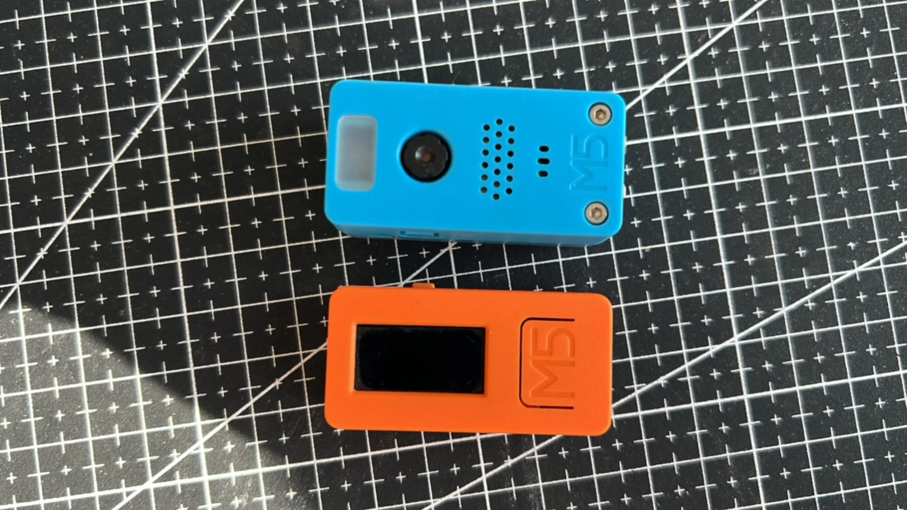

# M5Stack

M5Stack is a microcontroller board based on ESP32. It has a built-in Wi-Fi module and a USB port. It is designed for use with M5Stack's ESP32 module.

## M5Stick-V & M5Stick-C

<https://github.com/song940/m5stick-c>

---