# WeChat Miniprogram Development

# 1. 什么是微信小程序和微信小程序开发

在这篇教程中，我们将完整跑通一条闭环：从脑海中的一个想法，到在微信里可以搜索、可以扫码打开的真实小程序。

开始动手之前，我们需要先建立两个基本认知。

第一个是 **本质**：微信小程序到底是什么？它和普通 App、网页有什么不同？为什么这么多产品会选择用小程序这种形态？只有理解了小程序的底层逻辑，你才能判断自己的想法是否适合用小程序来实现。

第二个是 **路径**：当你说「我要做一个小程序」时，从零到上线的完整路径是什么样的？这条路上有哪些关键节点——构思阶段要考虑什么、开发环境怎么搭建、如何用 AI 辅助开发提高效率、模拟器调试有哪些坑、测试号和正式发布各自解决什么问题。把整个流程在脑子里先跑一遍，后面实操时才不会迷路。

搞清楚这两个问题之后，我们就可以正式进入开发环节了。接下来，让我们先从第一个问题开始：微信小程序究竟是什么。

## 1.1 微信小程序

微信小程序可以看成藏在微信里的应用。它不需要你去应用商店搜索、下载、安装，只要在微信里搜名字、扫码，或者点开别人分享的卡片，就能马上使用。用完直接关掉，下次需要再打开即可，不会长期占据你的手机桌面和存储空间。

对普通用户来说，小程序解决的是很多「一件小事」：查快递、点咖啡、看订单、玩一局小游戏。打开速度快、入口统一在微信里，这是它最大的体验特征。

对企业和开发者来说，小程序是一种可以被搜索、被分享的「小应用形态」。只要在微信公众平台上注册、配置好信息，通过审核，小程序就能对所有微信用户开放。和传统 App 相比，它更容易获得第一批用户，因为大家已经习惯在微信里完成很多事情。

在本教程里，我们不会做复杂的业务系统，而是选一个很经典的例子——贪吃蛇小游戏。它体量小、逻辑清晰，却又包含了一个完整小程序需要具备的元素：多个页面、简单交互、状态变化、分数记录等，非常适合作为你的第一个作品。

## 1.2 微信小程序开发

理解了「小程序是什么」，接下来要回答的问题是：那开发一个小程序，到底要做什么？

你需要有一个清晰的目标（例如：做一个可以随时玩一局的贪吃蛇），设计出用户会看到的界面，告诉系统在不同操作下应该发生什么，并最终把这个作品发布出去。

在传统的开发流程里，上面这些步骤往往都由程序员主导，需要写大量代码。而在 AI 辅助开发的场景下，这件事可以拆得更细：你负责讲清楚想做什么，AI 帮你完成大部分具体怎么写。 这也意味着，对于刚入门的人来说，最重要的能力不再是背多少语法，而是能不能把需求描述清楚、能不能读懂 AI 给出的结果。

## 1.3 微信小程序开发的几种方法

真正做小程序时，大家采用的技术路线并不完全一样。为了避免你一上来就被各种名词淹没，我们只做一个粗略分类，让你知道常见的几条路分别长什么样。

第一种方式，是直接使用微信官方提供的原生能力。在微信开发者工具中创建项目后，你会看到一组固定的文件类型，用它们来描述页面结构、样式和逻辑。这种方式贴近官方文档，控制力强，但对第一次接触前端的人来说，学习曲线会稍微曲折一些。

第二种方式，是利用多端框架，比如 uni-app 等。你在本地主要是写类似网页的代码（例如 .vue 文件），然后通过框架把这套代码转换成微信小程序可以识别的形式。这样的好处是：结构更统一，以后如果想把产品发布到其他平台（比如 H5、App），改动会相对少一些。

基于以上两种方式，本教程会重点讲述使用 AI 辅助开发工具的小程序开发SOP。比如把整个项目在 Trae 里打开，然后直接对内置的 AI 助手说： 请帮我在这个文件里加一个首页，有标题和按钮——请帮我写一个游戏页面，可以显示贪吃蛇和分数，AI 会在理解现有代码的基础上，为你生成新的代码片段，或者帮你修改、重构。

这三种方式并不是互斥的。你完全可以在一个 uni-app 项目里，借助 Trae 的 AI 功能来完成大部分编码工作。关键不是选哪一个方法，而是知道：自己现在处在什么位置，以及有哪些工具可以用。

## 1.4 本文介绍的微信小程序开发步骤（粗略预览）

本教程会带着**从环境到成品**的节奏，专门围绕贪吃蛇这个例子，结合 Trae 的 vibecoding 方式，把整个过程拆成一条你可以反复复用的路线。整体上，你将在后面的章节里经历这样几个阶段：

1. 先搭建认知地基：弄清楚什么是微信小程序、常见的开发方式有哪些，以及我们要做的这款贪吃蛇小程序面向谁、在什么场景被使用。
2. 然后完成环境准备：注册小程序账号，安装 HBuilderX、Trae 和微信开发者工具，并用 HBuilderX 创建一个可以在微信开发者工具中跑起来的基础项目骨架，让屏幕上先出现一个最简单的页面。
3. 接下来进入正式开发：在 Trae 中打开这个项目，用 vibecoding 的方式和 AI 对话，一步步生成首页和游戏页的布局，实现蛇移动、吃食物、游戏结束等核心玩法。
4. 在功能跑通之后，学会把 AI 当成「调试和重构伙伴」：遇到 bug 时请它一起排查，觉得结构乱时让它帮忙整理，并逐渐加上开始 / 暂停、最高分记录、界面微调等细节体验。
5. 最后进入发布环节：把项目构建成微信可识别的版本，在微信开发者工具中做预览和真机测试，先以测试号和体验版的形式上线验证流程，完成备案和审核后，再把小程序正式发布出去，让别人也能在微信里搜索到、玩到你的作品。

这一节只负责把全景图画出来，不展开具体命令和代码。你现在需要做的只是先大致记住这 5 步： **理解 → 搭环境 → vibecoding 开发 → 调试打磨 → 构建发布** 。后面的章节会在每一步上慢慢放大，告诉你要准备什么、要和 AI 说什么，以及在每个阶段你应该在屏幕上看到怎样的结果。

# 2. 环境准备

在开始写任何一行代码之前，我们先把开发环境准备好。 这一部分的目标，是让你在后面的章节里不再纠结 **去哪儿下载软件、为什么运行不了** ，而是可以直接把注意力放在和 AI 对话、实现需求上。

你只需要会打开浏览器、下载文件、双击安装程序，就可以完成本节全部步骤。

## 2.1 本教程会用到的三个工具

整个贪吃蛇小程序的开发，我们会同时用到三个工具，它们各自负责不同的环节：

1. 第一个是 Trae。你可以把它理解为一款集成了 AI 的代码编辑器，既能像普通 IDE 一样打开项目文件，又能让你直接用自然语言和 AI 交流，请它帮你写代码、改代码、解释代码。本教程里，大部分「和 AI 一起写小程序」的操作，都会在 Trae 里完成。你可以在浏览器中访问 https://www.trae.cn 获取最新版本。
2. 第二个是 HBuilderX。它是一款对 Vue 和 uni-app 支持特别好的编辑器，官方提供了很多现成的小程序项目模板。我们会用它来「一键生成」一个基础的小程序项目，相当于先打好地基，再把地基交给 Trae 和 AI 去改造。HBuilderX 的下载地址是 https://www.dcloud.io/hbuilderx.html 。
3. 第三个是微信开发者工具。这是微信官方提供的专门用来开发和预览小程序的工具。它负责把你写好的项目在电脑上跑起来，并支持在手机上进行真机调试。你可以从 https://developers.weixin.qq.com/miniprogram/dev/devtools/download.html 下载适合你操作系统的版本。

简单总结一下：HBuilderX 帮你快速建一个小程序项目，Trae 帮你和 AI 一起写代码，微信开发者工具帮你看到真正运行中的小程序。

## 2.2 注册微信公众平台账号并获取 AppID

有了工具，还需要一个 **小程序身份** ，这一步在微信公众平台上完成。 如果你之前从来没有注册过微信小程序，可以按照下面的顺序来做：

1. 在浏览器地址栏输入 https://mp.weixin.qq.com ，打开微信公众平台网页，用你的微信扫码登录。

2. 在首页选择「小程序」，按照页面提示完成注册流程，填写邮箱、手机号以及主体类型（个人或企业）。
   
3. 注册成功并进入后台后，找到「开发管理」或「开发设置」页面，就能看到一个唯一的编号，名字叫 AppID 。这个编号后面会用在项目配置里，相当于你这个小程序在微信里的身份证。

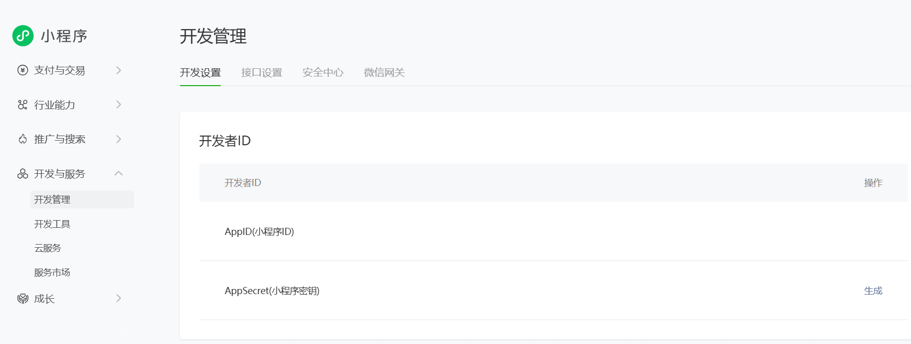

建议你把 AppID 记录在一个方便找到的地方。后续章节在配置项目时，我们会直接把这个值填进去，让本地项目和线上小程序对应起来。

## 2.3 安装微信开发者工具

接下来，我们需要一个地方实际运行和预览小程序，这就是微信开发者工具存在的意义。

1. 访问下载页面 https://developers.weixin.qq.com/miniprogram/dev/devtools/download.html 。 在这个页面上，你会看到针对不同操作系统的多个版本，通常选择与你电脑系统匹配的稳定版即可，比如 Windows 64 位或 macOS 版本。
2. 下载完成后，双击安装包，按照安装向导一步步点击下一步。如果你不清楚要改什么设置，保持默认选项就可以。
3. 安装结束后，从桌面或开始菜单启动微信开发者工具。首次启动时，它会在屏幕上显示一个二维码，提示你用手机微信扫码登录。用自己的微信扫码并确认授权后，就可以进入主界面。

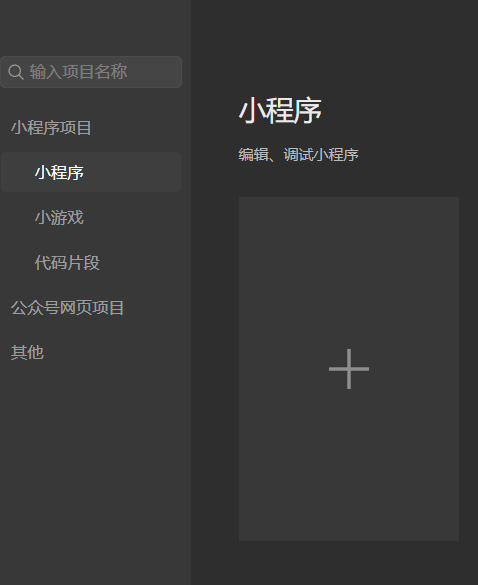

后面当我们在 Trae 中准备好项目文件之后，就会把构建好的小程序导入到微信开发者工具里，在这里看到真实的运行效果。

## 2.4 准备 Trae 和 HBuilderX

最后，我们把真正负责写项目的两个工具安装好：Trae 和 HBuilderX。

你可以 **先安装 Trae** 。打开浏览器访问 https://www.trae.cn ，根据页面提示下载适合你系统的版本。安装过程和普通软件一样，双击安装包，按提示完成即可。安装完成后，你会得到一个可以打开本地文件夹、查看代码、和 AI 对话的 IDE，后续所有 vibecoding 步骤都会在这里进行。

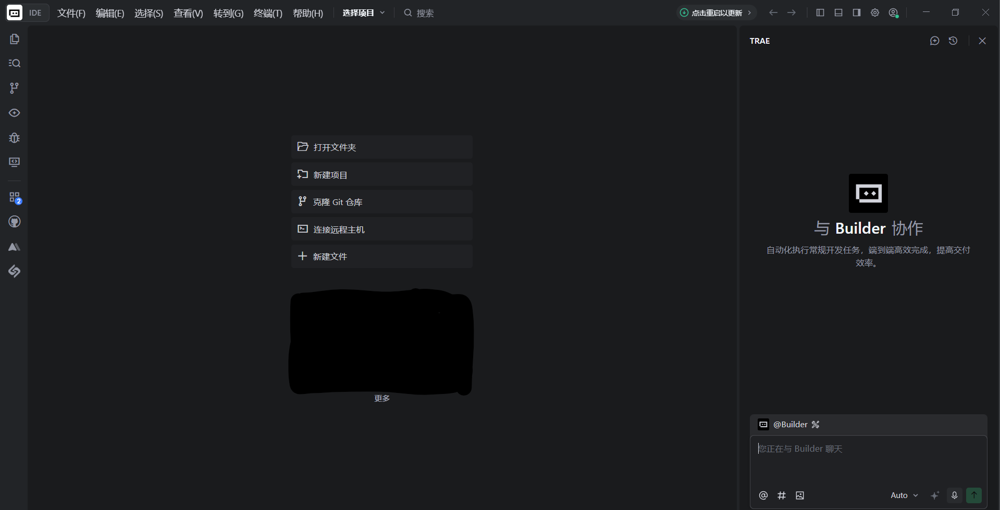

**接着安装 HBuilderX** 。访问 https://www.dcloud.io/hbuilderx.html ，选择对应操作系统的发行包下载。HBuilderX 的包体非常小，启动速度也很快。安装完成后，你可以先熟悉一下它的界面，不需要深入研究功能；在后面的章节中，我们会用它来创建一个 uni-app 小程序模板，作为整个项目的起点。

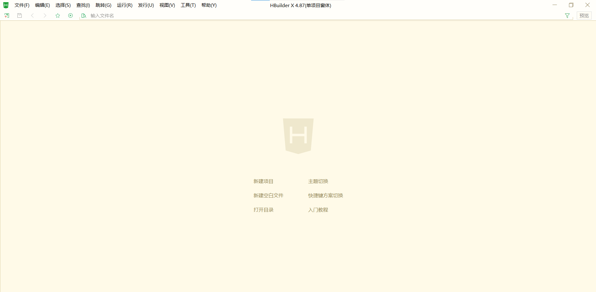

完成本节的所有步骤之后，你已经具备了完整的开发环境：有微信小程序的账号和 AppID，有可以预览的小程序运行环境，也有可以和 AI 一起写代码的 IDE。在接下来的部分，我们会从**创建第一个小程序项目骨架**开始，让这些工具真正跑起来。

## 2.5 基础文件准备

1. 点击新建项目

2. 选择默认模板，给小程序起名，选择存放路径，带你及右下角的创建：

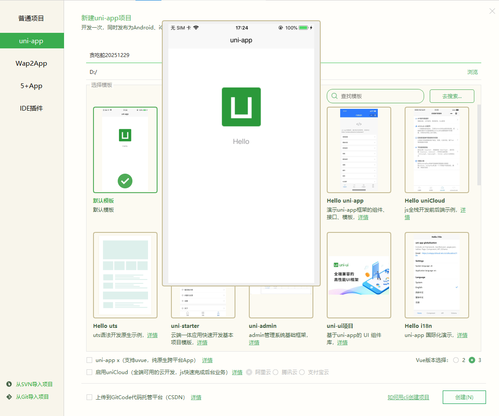

3. 显示创建成功！

4. 接着可以在对应的文件夹中找到该文件夹，在Trae里面打开该文件夹，可以看到地基文件已经全部建造好：

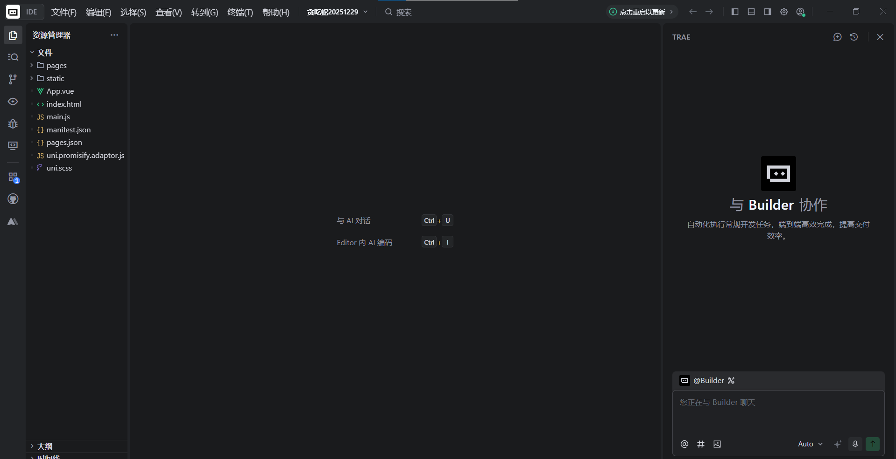

# 3. 小程序开发

前面两部分，我们已经搞清楚了「小程序是什么」、以及「环境怎么配、工具怎么装」。 从这一节开始，正式进入实战：不再停留在概念层面，而是让 AI 真正帮你把贪吃蛇小程序从无到有做出来。

这一节，你会完整走完一次「开发环节」的 SOP，大致包括几步：

1. 在 Trae 里把当前项目打开，给 AI 下第一条完整指令，让它基于现有骨架设计并实现一个可运行的贪吃蛇版本。
2. 让 Trae 直接改动真实项目文件，而不是只给你“示例代码”，并学会用回退功能在需要时恢复到修改前的状态。
3. 回到 HBuilderX 和微信开发者工具，通过「运行到小程序模拟器」的方式在模拟器里试玩这一版，实现从“代码视角”到“用户视角”的切换。
4. 根据试玩结果，用自然语言持续提出修改需求，让 AI 帮你从按键控制迭代到摇杆控制，顺便体验一次「发现问题 → 描述问题 → AI 修复 → 再次验证」的闭环。

你当然可以选择先在开发前，把每个页面、每个按钮都想得一清二楚，再交给 AI。 但对完全小白来说，小程序的界面和交互设计本身也是一个全新的领域（后面我们会教你怎么用 AI 帮忙做设计），所以在这一次，我们刻意采用另一种方式： 先开干 ——让 AI 先生成一个能跑起来的版本，再一边看效果、一边用自然语言慢慢打磨和调整。

## 3.1 把需求一次性说清楚：给 Trae 下第一条“总指令”

打开 Trae，载入前面已经准备好的小程序项目之后，我先没有急着改某一行代码，而是对内置的 AI 助手说了这样一件事：

**我向AI“发号施令”，说我现在需要基于现在的框架写一个贪吃蛇小程序，请给设计此小程序并我写一个prompt。**

也就是说，我不是「一点点要求它写某个函数」，而是先抛出一个完整目标，让 AI 帮我规划，但是AI不仅帮我做了计划，还直接落地第一版实现。

Trae 收到这条指令之后，会自动阅读当前项目结构，判断应该在哪些文件里增加页面、在哪些地方补充逻辑，然后直接对项目中的文件或代码做出修改，而不需要你自己去手搓代码或者增删改查文件/文件夹。

## 3.2 让 AI 自动修改代码，而不是“手搓”

当你在 Trae 中点击执行这条指令时，AI 会进入一个「帮你改工程」的流程。 在这个过程中，你可以看到几个关键点：

1. 它会在对话区解释自己的思路，比如会在哪个目录下新增页面、打算如何组织游戏逻辑。

2. 它会直接对真实项目文件做增删改，而不是只给你一段「示例代码」让你自己拷贝。
3. 修改完成后，Trae 会生成一个简短的小结，告诉你：这次它改了哪些文件，大致做了哪些事情。

如果你对这一轮修改不满意（或者觉得某一步有问题），也不用紧张。Trae 在你发出对话的对话框外的左上角提供了「回退」能力，你可以一键把工程恢复到本次指令执行之前的状态，相当于给这次操作加了一个安全的撤销键。

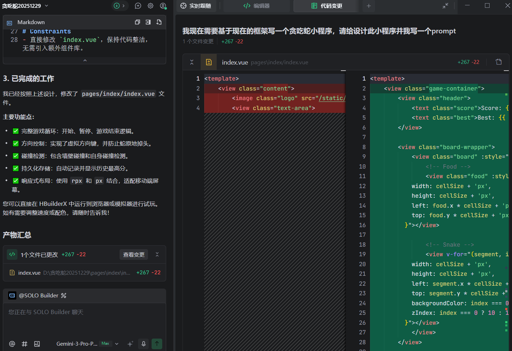

## 3.3 在 HBuilderX 和微信开发者工具中查看效果

AI 完成第一轮开发之后，代码已经落在项目里了，但这时候你还没有看到玩家视角的效果。 下一步，我们需要把它跑起来。

具体做法是：回到 HBuilderX，找到顶部菜单的「运行」选项，选择「运行到小程序模拟器」中的「微信开发者工具」。这一操作会触发项目编译，并将结果交给微信开发者工具打开。

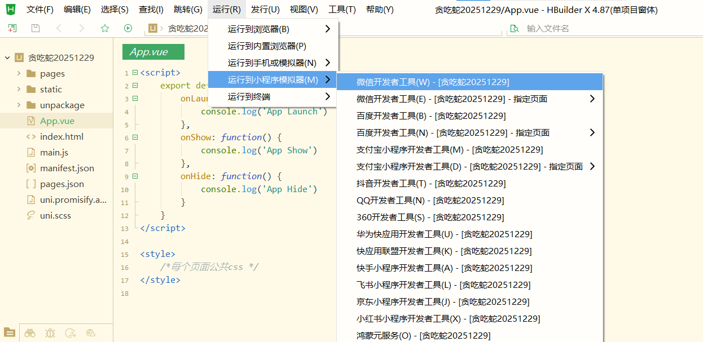

底部的输出窗口会显示编译的过程。如果最终状态是「ready」且没有报错，就说明构建成功，你可以切到微信开发者工具里查看这一版小程序的界面和功能。

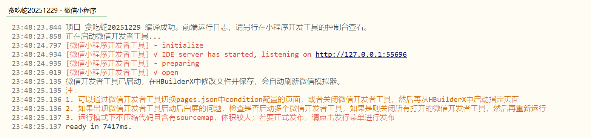

在大多数情况下，HBuilderX 会自动帮你打开微信开发者工具，让你直接看到新的小程序。如果没有自动打开，你可以按下面的方式处理：

1. 先在 HBuilderX 中停止当前运行。
2. 手动启动微信开发者工具，让它处于打开状态。
3. 回到 HBuilderX，再次点击「运行 → 运行到小程序模拟器 → 微信开发者工具」。

这样我们就可以微信小程序开发者工具中看到我们Vibecoding的小程序：

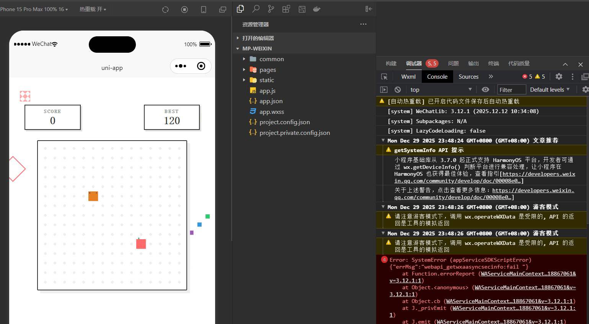

## 3.4 用自然语言反复调整和完善小程序，直到我们满意

在这次实践中，AI 一开始给我生成的是按键控制方向的贪吃蛇：屏幕上有四个方向按钮，点击不同方向，蛇就会改变运动方向。 功能上完全可以玩，但我个人更喜欢用摇杆控制。对于你的调整需求（不仅限于功能、UI设计、界面，等你熟练后，你甚至可以用自然语言让AI帮你接入其他大模型的API或接入数据库）——再强调一遍，你只需要用自然语言告诉大模型即可。

这就是 vibecoding 的优势所在：你不必自己去翻代码，查找事件绑定的位置、计算坐标的逻辑，而是直接把想法告诉 AI。例如，你可以在 Trae 的对话框里这样描述：

把按键换成摇杆控制，并且用户松开摇杆时蛇保持同方向移动，直到用户再次松开摇杆。

只要你把需求讲得足够清楚，AI 会自动定位到对应界面和逻辑文件，替你完成控件样式、交互绑定和方向处理等改动。

修改完成后，再回到微信开发者工具中查看。 如果没有立刻看到变化，可以尝试点击开发者工具上的「运行」按钮，或者刷新小程序预览窗口，让最新的构建结果生效。 仍然没有更新时，可以在 HBuilderX 中先停止运行，再重新执行一次「运行到小程序模拟器」，即可看到调整之后的小程序：

## 3.5 出现问题怎么办：继续用自然语言沟通

AI 生成的版本不一定一开始就完美。有时候你会遇到这些情况：

- 运行时报错，小程序无法正常打开；
- 功能大致正确，但细节和你想象的不太一样；
- 界面可以用，但你觉得还可以更好看或更顺手。

在这些时候，不需要自己钻进代码里盲改，而是可以把遇到的问题直接用自然语言重新描述给 Trae 中的 AI 助手，例如：

现在摇杆控制已经生效了，但有时候蛇会突然停止不动，请帮我检查当前实现哪里有问题。 或者： 现在游戏可以玩，但界面有点拥挤，我希望在手机上显示时上下留出更多空白。请你帮我调整布局。

AI 会根据你当前的项目状态和描述，给出修改建议并直接应用在代码里。如果修改之后结果更糟或方向不对，你依然可以使用回退，把工程恢复到前一个稳定版本，再换一种说法尝试。

通过这几轮往返，你会从最初的“毛坯版本”，逐步打磨出一个更贴近自己喜好的摇杆版贪吃蛇小程序。例如我给出了一种图画风格，让AI根据此风格来调整小程序的UI风格：

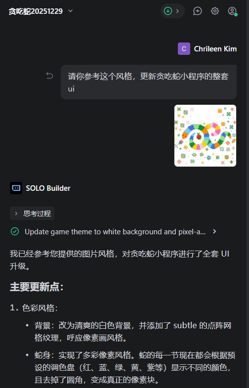

## 3.6 最终成品与本节小结

经过一轮又一轮的 **自然语言叙述 → AI 修改 → 在微信开发者工具中预览 → 继续对话微调** ，我最终得到的是这样一个成品：

- 有完整的游戏页面；
- 蛇可以顺畅移动并吃到食物；
- 支持摇杆控制；
- 在小程序模拟器中可以顺利运行。

最终开发成品如下：

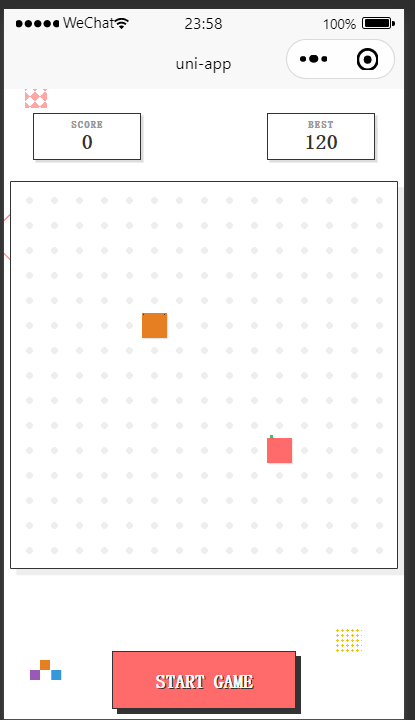

在这一节里，你已经看到了一个完整的闭环：

1. 在 Trae 中用一句清晰的指令，让 AI 搭出第一版贪吃蛇小程序；
2. 借助 HBuilderX 和微信开发者工具，从用户视角检查实际效果；
3. 用自然语言反复向 AI 提出修改需求，让它替你完成功能调整和界面优化；
4. 在任何一步出现问题时，都可以通过回退和重新运行来保证安全。

接下来，你可以按照同样的节奏去尝试自己的想法：不一定非要是贪吃蛇，也可以是一个工具小程序、一个活动页，甚至是你工作中真正需要的业务原型。你的主要任务，是把需求想清楚、说清楚，其余的交给 AI 和这些工具来配合完成。

# 4. 小程序发布

前面三章，我们已经完成了从 **搭环境** ——**和 AI 一起开发**到**在本地模拟器里跑通贪吃蛇**的整个流程。

从这一章开始，我们关心的问题变成了：**怎样把这个作品真正挂到微信上，不只是一个小玩具，而是所有人都可以使用的微信小程序呢？**

为了降低门槛，我们先走一条 **最短闭环** ：只让它以**测试号**的形式上线，先自己和少数同学体验；等到你觉得功能和体验都足够稳定，再走正式上线流程。

本章先讲到 4.1，帮你完成**测试号上线**这条最短路径；关于面向所有用户的正式上线，会在 4.2 中再展开。

## 4.1 最短 SOP —— 测试号上线

这一小节的目标只有一个：让你在微信里，真的能以**体验版**的形式打开自己的贪吃蛇小程序。

整个流程可以理解为四件事：

1. 在微信公众平台找到并确认自己的 AppID。
2. 在项目里把这个 AppID 配置好。
3. 用微信开发者工具上传当前版本。
4. 回到公众平台，把这次上传的版本设置为「体验版」。

下面我们按照这个顺序来走一遍。

### 4.1.1 在微信公众平台确认 AppID

第一步，是在微信公众平台上确认你的小程序 AppID。

这一步你之前在**2.环境准备**时已经做过一次，这里是把它真正用起来。

1. 打开浏览器，访问 `https://mp.weixin.qq.com`，登录你的小程序后台。
2. 在左侧菜单中找到「开发管理」，进入其中的「开发设置」。
3. 在页面上方，你会看到一块叫做「开发者 ID」的区域，里面有一行「AppID（小程序 ID）」——这就是你的小程序唯一编号。

这串编号需要和项目中的配置一一对应，否则微信会认为你上传的是「别人的小程序」，自然无法正常预览和发布。

### 4.1.2 在项目中填写 AppID

第二步是把这个 AppID 写进你的项目配置里，让本地构建出来的小程序和公众平台上的这个「账号」对应上。

如果你是用 uni-app 模板来做的项目，可以按照下面的方式操作：

1. 打开 HBuilderX，载入你的贪吃蛇项目。
2. 在左侧文件树中找到 `manifest.json`，双击打开。
3. 下拉到「微信小程序配置」这一栏，你会看到一个输入框，提示类似「微信小程序 AppID（请在微信开发者工具中获取）」。
4. 把刚才在公众平台上看到的 AppID 原样粘贴进来，保存文件。
   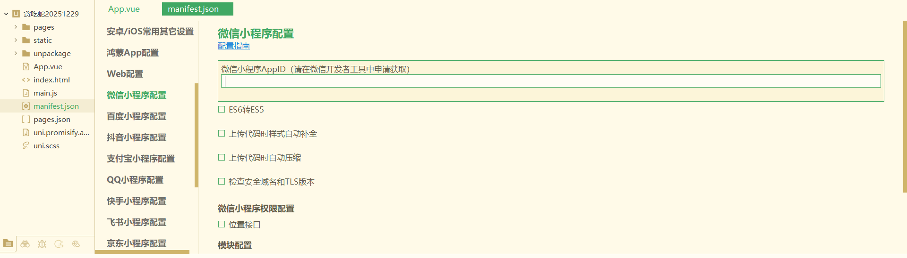

到这里为止，你的本地项目就已经认领了这个小程序身份。接下来，只要通过微信开发者工具上传版本，它就会被记在这个 AppID 名下。

### 4.1.3 在微信开发者工具中上传一个版本

前面我们已经用 HBuilderX 把项目运行到微信开发者工具里，看过模拟器中的效果。

现在要做的是：在开发者工具中，把当前这份代码“”打一个版本包”上传到服务器上。

大致步骤如下：

1. 在微信开发者工具顶部工具栏的右侧，你会看到一个「上传」按钮，点击它。
2. 弹出的窗口中，需要填写两个关键字段：
   1. 版本号：例如 `1.0.0`，只允许数字和小数点。
   2. 项目备注：写一段简短说明，比如「完成基本功能的开发」。
3. 检查无误后，点击「上传」按钮。下面的输出区域会显示编译过程，所有步骤变成绿色并提示上传完成，就说明这一版已经成功提交到了微信服务器。

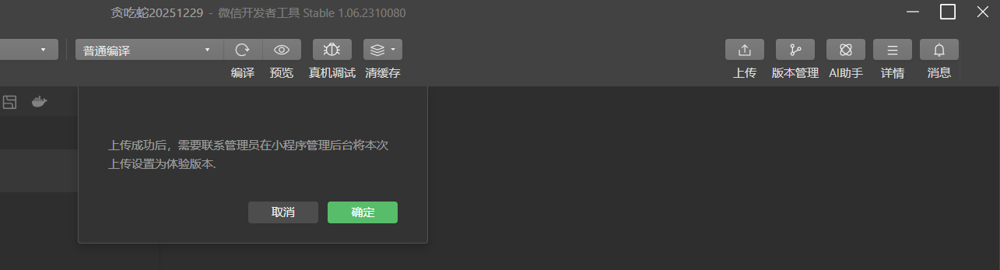

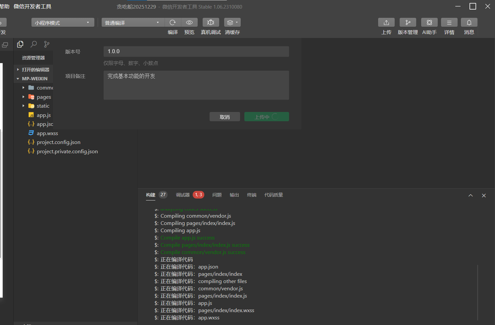

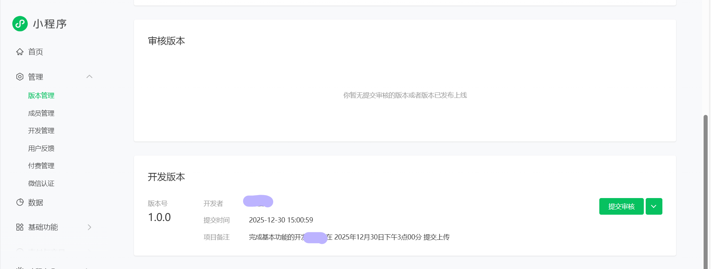

### 4.1.4 在管理后台中把版本设为体验版

上传只是把代码送到了微信这边，还没告诉系统“这是一版可以试用的体验版本”。

最后一步，我们回到公众平台的小程序后台，完成这个闭环。

1. 再次打开 `https://mp.weixin.qq.com`，进入你的小程序后台。
2. 在左侧找到「管理」下面的「版本管理」，点击进入。
3. 在页面的「开发版本」一栏，你应该能看到刚刚上传的那个版本：版本号是 `1.0.0`，备注是你写的那一段说明，时间是刚刚的上传时间。
4. 在这一行的右侧，会有一个下拉按钮或操作按钮，可以选择「设为体验版」，点击之后，确认操作，注意在这一步之前请确保你已经在首页-小程序类目设置好了你的主营类目。

   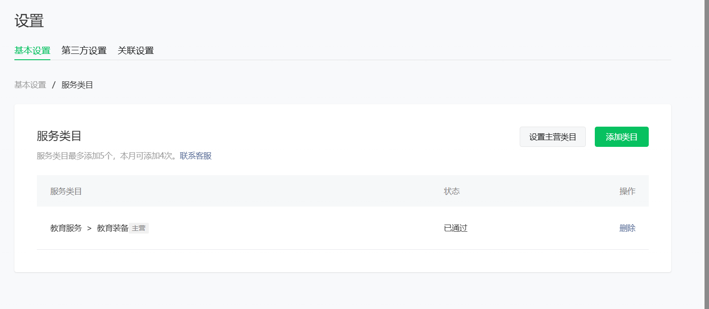

   

完成之后，这个版本就变成了你的小程序「体验版」。你可以在后台生成体验版二维码，也可以把自己和同事加入「体验成员」，让大家用微信扫描后，在真机上体验这款贪吃蛇小程序。

到这里，我们就完成了从本地项目到测试号上线的最短闭环：

你不需要一开始就面向所有微信用户开放，只是在一个安全的范围内，让真实的小程序跑在真实的微信环境里。这足够你用来测试功能、收集反馈、继续迭代。

## 4.2 小程序正式上线

体验版跑通之后，你已经可以在自己的微信里玩到这款贪吃蛇小程序了。 接下来要做的，就是把它从只有少数体验成员能用的状态，推进到全民可用正式微信小程序。

把这件事拆成几步：先补充信息，再选择类目，然后完成备案，最后提交审核。下面按照这个顺序走一遍。

### 4.2.1 进入小程序发布流程

首先回到微信公众平台后台，登录你的小程序账号。 在左侧导航里找到与「版本管理 / 发布」相关的入口（不同时间界面可能略有调整），展开后会看到「小程序发布流程」这一项。

点击进入之后，界面上方会显示一个进度条，下面依次列出几个步骤，例如：

1. 小程序信息
2. 小程序类目
3. 运营信息 / 小程序备案
4. 微信认证（视你的主体而定）

一开始进度会显示 0%，随着你完成每一步，系统会自动把进度向前推进。

### 4.2.2 填写小程序基本信息

第一步是把小程序的「名片」补充完整，这也是用户在微信里第一次看到你的时候会接触到的内容。

在「小程序信息」页面，你通常需要填写和确认以下内容：

1. 小程序名称 这个名字会出现在搜索结果和小程序顶部，有长度限制，同时需要符合微信的命名规范。建议选择既能表达功能，又方便记忆的名称，例如「贪吃蛇 vibecoding 版」这一类。
2. 功能介绍 / 简介 用一两句话说明这个小程序是做什么的，例如：「一款用 AI 辅助开发完成的贪吃蛇小游戏，适合在碎片时间玩一局。」 注意简介要和实际功能一致，避免使用夸张宣传语。
3. 图标和展示图片
   1. 图标一般要求为正方形图片，支持 PNG/JPG 等格式，大小和像素有明确限制（以页面说明为准），建议提供一张简洁、对比度高的图。
   2. 展示图片可以上传几张小程序页面的截图，例如首页、游戏页面、设置界面等，这些会出现在详情页中，帮助用户了解内容。
4. 其他必要信息 例如标签、服务区域等，根据页面提示填写即可。 原则只有一个：所有填写的内容都要和这款贪吃蛇小程序真实功能相符。

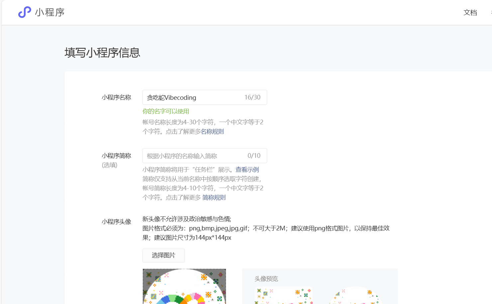

全部填写完毕后，点击保存或下一步，发布流程中的第一步就完成了。

### 4.2.3 选择小程序服务类目

完成基本信息后，向导会引导你进入「小程序类目」步骤。 类目可以理解为小程序在微信里的「归属分类」，决定它在审核时会被归入哪一类应用，也会影响后续展示和运营。

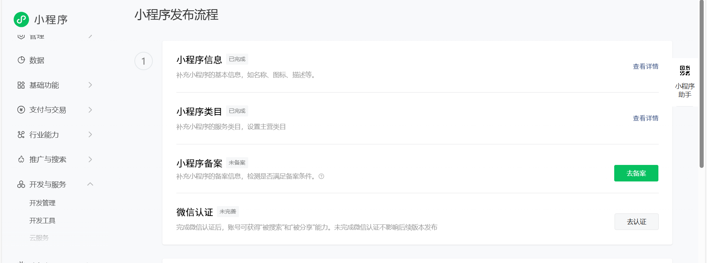

在这个页面，你会看到「添加类目」按钮。点击后，可以从系统提供的分类树中选择适合你小程序的方向，例如：

1. 先选择「教育」这一大类；
2. 再在下面选择「教育工具 / 教学辅助」等更具体的子类，本次我选择了教育器具，当做大家学习Vibecoding的教具吧~

你在自己的项目里，只需要根据实际用途选择最贴切的一项即可。

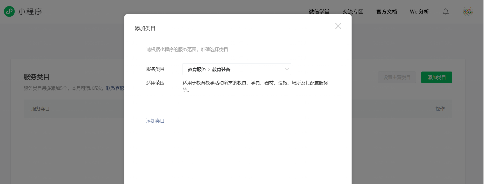

确认类目后，点击保存。如果页面提示「创建类目成功」，并在列表中显示你刚刚添加的那一项，就说明这一步已经完成。

### 4.2.4 完成小程序备案信息

接下来，发布流程会要求你完成「运营信息 / 小程序备案」部分。这一步是为了验证小程序的主体身份，确保上线的应用有明确责任人。

在个人主体的示例下，大致会经历这样几个动作：

1. 选择备案类型 页面会让你在不同主体类型之间进行选择，例如「个人」「企业」等。根据你注册小程序时的主体保持一致即可。
2. 填写主体信息 包括姓名、证件类型、证件号码等基本信息。 这一部分需要与注册信息保持一致，否则可能会在审核时被退回。
3. 上传证明材料 页面通常会要求你上传身份证照片或其他证明文件，具体格式、清晰度和大小要求会写在说明里。 按提示准备好图片后上传，确保内容清晰可辨。
   

提交之后，系统会进入「审核中」状态，页面上会显示类似「信息已提交，请耐心等待」的提示。这个过程可能需要一定时间，你可以在后台随时查看备案进度。

### 4.2.5 提交审核并等待正式发布

当「小程序信息」「小程序类目」「运营信息 / 备案」等步骤全部被勾选完成后，你就可以进行最后一个动作：提交审核。

1. 回到「小程序发布流程」总览页面，确认每一项都显示为已完成，进度条接近 100%。
2. 根据页面提示，点击「提交审核」或类似按钮，把当前开发版本送交微信团队审核。
3. 在「版本管理」中，你会看到这次提交的版本状态变为「审核中」。通过后，会变成「已发布」或可选择「上线」的状态。

备案审核不通过会打电话给开发者，提示不通过的部分。

备案会收到“工业和信息化部”发来的验证码，和核验链接，点击进入把验证码和个人信息填入就行（核验有效期是1天）备案通过会收到“工业和信息化部”发送的邮件和短信通知，并且告知备案号。微信认证：个人缴纳30元，公司企业貌似是300元，不管认证是否通过都钱都不退回，会收到认证通知，并且接到电话确认信息

提交进行审核，要上传操作视频和页面，填好信息提交即可 ，点击“提交发布”，就正式发布了

# 5. 总结

到这里，你已经完整跑完了一次**从0到1**的小程序开发闭环： 从认识微信小程序，到装好 Trae、HBuilderX 和微信开发者工具；从把想法丢给 AI，让它在代码里替你“搬砖”，到在模拟器里试玩第一版贪吃蛇；再到把作品打成体验版、走完备案和审核，真正在微信里让人使用——这条链路你已经亲手走通了一遍。

更重要的是，你不是靠死记硬背语法做到这一点的，而是靠清楚地表达需求 + 和 AI 有效沟通来实现的 。你已经体验过 **:一句自然语言指令，可以让AI完美满足你的开发要求** 。这种能力不会只停留在贪吃蛇上，它可以迁移到你以后想做的任何小程序——工具、活动页、教学应用，甚至是你工作中的真实项目。

如果要给你一个 **通用SOP** ，其实只有五步：** 想清楚一个小需求 → 在 Trae 里搭好项目骨架 → 用 vibecoding 和 AI 搭出第一版 → 在微信开发者工具里不断试玩和改进 → 上传、备案、审核、上线。** 每次你重复这五步，就会多一个真正能被人打开、能被分享的小程序，也会多一份「我可以用 AI 把点子变成产品」的信心。

接下来，你可以继续打磨这款贪吃蛇，也可以关掉它，重新起一个空项目，从你自己的想法出发。无论做什么，只要记住一点： 你不再只是一个「想做点东西」的人，而是已经跑通了全流程的 vibecoding 开发者。剩下的，就是多做几次，把这种能力变成习惯。

# 参考资料：

- https://zhuanlan.zhihu.com/p/1889401120939567074
- https://blog.csdn.net/2401_87407347/article/details/155193007
